# Any Hand Concept

Any Hand is typically used with an (anything) call that starts
with the right hand and is defined
to consist of, or begin with, a series of one or more Turn actions
(examples: [Swing Thru](../b2/swing_thru.md),
[Quarter Thru](quarter_thru.md), [Remake](../a2/remake.md)).
The parts of the (anything) call are all done in the same order, and for each Turn
the same fraction is used, but the hand used may be different and the dance action may be
modified.

Starting formation: Inverted Line(s), Inverted Box(es), Diamond(s). 
Every partner pair must be in a Right-Hand or Left-Hand Mini-Wave.

> 
> 
>

Dance action: The first Turn in the series is performed by each pair of partners, who become
active and Turn the appropriate amount by whichever hand (Right or Left) connects them.
For every Turn in the series after the first, 
if a dancer was active on the previous Turn and can
now use the other hand to hold the hand of a different dancer, then both those dancers become
connected and active for the current Turn (and it doesn't matter whether that other dancer was
active on the previous Turn). If two dancers who connect in this way are in a Mini-Wave, they
Turn by the appropriate amount; but if they are in a Couple, the turn is modified as follows:

- Turn 1/4 : if in a couple, use Cast Off 1/4
- Turn 1/2 : if in a couple, use Partner Trade
- Turn 3/4 : if in a couple, use Cast Off 3/4

All other dancers become inactive for the current Turn.

After the last Turn in the series, all dancers become active
for the remaining parts of the call (if any).

Example #1: Any Hand Swing Thru

> 
> 
> 

Example #2: Any Hand Quarter Thru

> 
> 
> 

Example #3: Any Hand Three-Quarter Thru

> 
> 
> 

Example #4: Any Hand Remake

>
> 
>

Comments: The call Any Hand (anything) is proper only if there are at least
two dancers active for each Turn in the series.

If the (anything) call is a 4-dancer call, then Any Hand (anything)
is a 4-dancer call (example: Any Hand Quarter Thru). If the (anything) call
is an 8-dancer call, then Any Hand (anything) is an 8-dancer call
(example: Any Hand Grand Quarter Thru).

Example #5: from Left-Hand Point-to-Point Diamonds, the call
Any Hand Three-Quarter Thru has the centers of each diamond Turn 3/4 by the Left —
the very centers do not Turn 3/4 by the Right because this is a 4-dancer call —
then all Partner Trade to end in a Right-Hand Tidal Two-Faced Line.

>
> 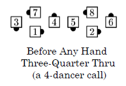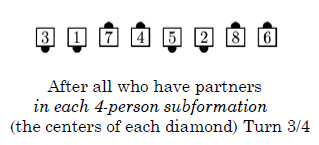
>

Example #6: Any Hand Grand Three-Quarter Thru

>
> 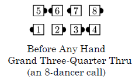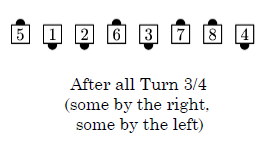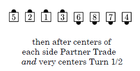
>

Example #7: Any Hand Grand Remake

>
> 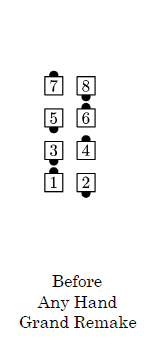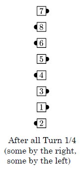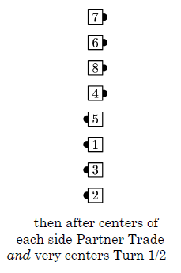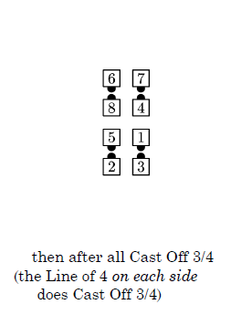
>

Example #8: Any Hand Grand Remake

>
> 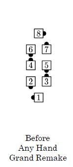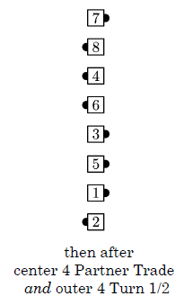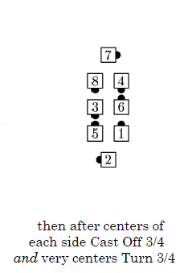
>

The Facing Couples Rule does not apply with to Any Hand (anything), 
regardless of whether that rule applies to the (anything) call itself.

If the Ocean Wave Rule applies to (anything), 
then Any Hand (anything) is proper if and only if:  
(a) the definition of the (anything) call begins with Step to a Wave, then a Turn by the right, and  
(b) all dancers are already in Mini-Waves.

Example #9: Any Hand Turn Thru

>
> 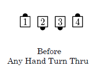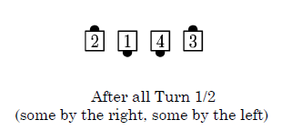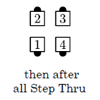
>

Any Hand is sometimes used with an (anything) call that can start with either hand,
to alert dancers that some will start with the right hand and some will start
with the left hand. In such cases the use of Any Hand does not actually alter
the dance action. For example, from an Inverted Line, 
Any Hand Hinge has exactly the same dance action as Hinge. 
(Compare this to the occasional use of Left Hinge from a Left-Hand Wave: 
it has the same dance action as Hinge, but
reminds all dancers to use the left hand.)

Example #10: Any Hand Swing and Mix (same dance action as for Swing and Mix)

>
> 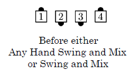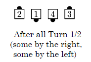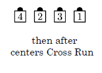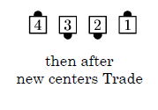
>

###### @ Copyright 1982, 1986-1988, 1995, 2001-2023. Bill Davis, John Sybalsky, and CALLERLAB Inc., The International Association of Square Dance Callers. Permission to reprint, republish, and create derivative works without royalty is hereby granted, provided this notice appears. Publication on the Internet of derivative works without royalty is hereby granted provided this notice appears. Permission to quote parts or all of this document without royalty is hereby granted, provided this notice is included. Information contained herein shall not be changed nor revised in any derivation or publication.
