# Any Hand Concept

This concept is used with calls that start with the right hand 
and are defined as a series of turns (e.g.,
[Swing Thru](../b2/swing_thru.md),
[1/4 Thru](quarter_thru.md),
[Remake](../a2/remake.md)).

Starting formation: Inverted Line or Inverted Box;
**every pair** of dancers must be in a right or lefthand
mini-wave.

> 
> 
> 

Dance action: Dancers start by having everyone in a mini-wave (pair) 
turn by either the right or left
hand the appropriate amount. 
The call continues, with the following modifications as necessary:

- Turn 1/4 – if in a couple, use Cast Off 1/4
- Turn 1/2 – if in a couple, use Partner Trade
- Turn 3/4 – if in a couple, use Cast Off 3/4

For example, after a Heads Square Thru 4, Centers In, 
the call Any Hand Swing Thru would have all
dancers turn half (some by the right and some by the left)
and the new centers Partner Trade to end
in Facing Lines.

The [Facing Couples Rule](../b2/facing_couples_rule.md)
does not apply with this concept.

Example #1: Any Hand Swing Thru

> 
> 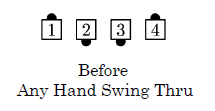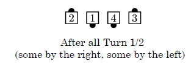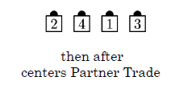
> 

Example #2: Any Hand 1/4 Thru

> 
> 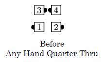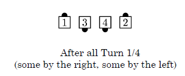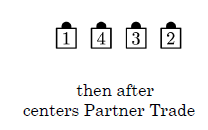
> 

Example #3: Any Hand 3/4 Thru

> 
> 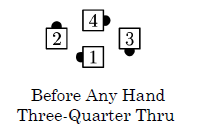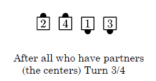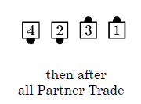
> 

Example #4: Any Hand Remake

> 
> 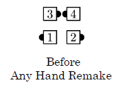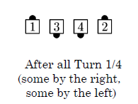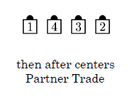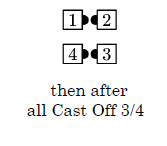
> 

###### @ Copyright 1982, 1986-1988, 1995, 2001-2020. Bill Davis, John Sybalsky, and CALLERLAB Inc., The International Association of Square Dance Callers. Permission to reprint, republish, and create derivative works without royalty is hereby granted, provided this notice appears. Publication on the Internet of derivative works without royalty is hereby granted provided this notice appears. Permission to quote parts or all of this document without royalty is hereby granted, provided this notice is included. Information contained herein shall not be changed nor revised in any derivation or publication.
