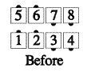
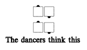
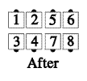

# As Couples Concept

This is used to modify a call. Each Couple acts as though it were a single dancer, and does the part
of the call appropriate to its position in a starting formation that is composed of Couples.

For example, from Parallel Right-Hand Two-Faced Lines consider As Couples Walk and Dodge.
Each Couple works as a unit, and these units act as though they were in a Right-Hand Box. The
Couples facing in take the part of single dancers facing in, so they walk forward, and the Couples
facing out take the part of single dancers facing out, so they slide sideways to the right. The result
is Lines Facing Out.

> 
> 
> 
> 
> 

For Teaching: No one should let go of his partner during an As Couples call.

###### @ Copyright 1982, 1986-1988, 1995, 2001-2026. Bill Davis, John Sybalsky, and CALLERLAB Inc., The International Association of Square Dance Callers. Permission to reprint, republish, and create derivative works without royalty is hereby granted, provided this notice appears. Publication on the Internet of derivative works without royalty is hereby granted provided this notice appears. Permission to quote parts or all of this document without royalty is hereby granted, provided this notice is included. Information contained herein shall not be changed nor revised in any derivation or publication.
