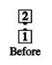
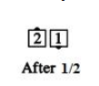
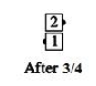

# Touch 1/2, 3/4

Fractions other than 1/4 are allowed with Touch. 
For example, the call "Touch 1/2" is the same as 
"Touch and Trade." In the same way, "Touch 3/4" is
"Touch and Cast Off 3/4:"

>
> 
> 
> 
>

###### @ Copyright 1982, 1986-1988, 1995, 2001-2023. Bill Davis, John Sybalsky, and CALLERLAB Inc., The International Association of Square Dance Callers. Permission to reprint, republish, and create derivative works without royalty is hereby granted, provided this notice appears. Publication on the Internet of derivative works without royalty is hereby granted provided this notice appears. Permission to quote parts or all of this document without royalty is hereby granted, provided this notice is included. Information contained herein shall not be changed nor revised in any derivation or publication.
