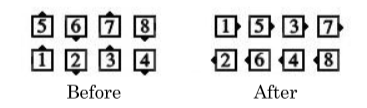
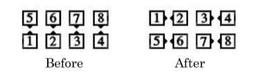
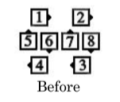
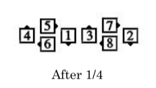
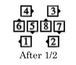
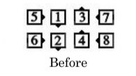
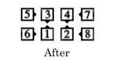

# Split Counter Rotate [fraction] and related calls

Timing: 1/4: 4

[*At Advanced these calls are proper only from Boxes or Diamonds as described below.*]

The Counter Rotate action involves dancers moving forward a specified amount around a center
point. At Advanced, this action is restricted to a Diamond or a 2x2 Box (for example, Right-Hand
Box, Left-Hand Box, Facing Couples, or Back-to-Back Couples). The first word(s) in the call must
identify the 4-dancer formation(s) either explicitly such as “Center Box Counter Rotate” or
“Center Diamond Counter Rotate”, or implicitly such as “Split Counter Rotate” or “Transfer and
Box Counter Rotate”.

Each of these calls may have a fraction after it. The fraction indicates what portion of a full circle
each dancer moves around the center point of the four-dancer formation. If no fraction is given,
1/4 is implied and the rotation is 90 degrees.

**Split Counter Rotate** can begin from any applicable formation that can be divided across its
long axis into two side-by-side four-dancer formations with no dancers facing directly toward or
away from the center of their group of four. *At Advanced, this call is proper only from applicable
2x4 formations (for example, Parallel Waves or Columns), or from Twin or Point-to-Point
Diamonds.*

**(Designated Box) Counter Rotate** or **(Designated Diamond) Counter Rotate** can begin
from any applicable formation that has a Box or a Diamond of four dancers.

Beginning in an appropriate Box or Diamond, each dancer moves forward in a smooth arc around
the center while changing facing direction by the designated amount (90 degrees for 1/4, 180
degrees for 1/2, 270 degrees for 3/4). During this action, each dancer maintains the same distance
from the center, except while applying the Passing Rule. Before moving, dancers should identify
their relative position in the Box or Diamond, and plan to end in the same relative position (such
as Leader or Trailer, Beau or Belle, Center or Point).

Every dancer can Roll at the end of these calls.

Styling:

When in a Right-Hand Box or Left-Hand Box, both Mini-Wave handholds are maintained while
the four dancers simultaneously rotate the whole Box the designated fraction around the center
point of the Box.

For more general 2x2 formations, dancers may need to drop hands and move independently of the
other dancers in the formation (passing right shoulders if necessary), and reconnecting with new
partners at the end of the call.

When in a Diamond, the centers of each Right-Hand or Left-Hand Diamond maintain their
handhold and all four dancers simultaneously rotate the designated fraction around the center
point of the Diamond. From a Facing Diamond, the centers of the Diamond maintain their
handhold and stay in the center as dancers pass. For Split Counter Rotate, Twin Diamonds
become Point-to-Point Diamonds and vice versa. Handedness is maintained.

The diagrams below show the beginning and ending positions for the four possible roles a single
dancer might play in a Box Counter Rotate 1/4. A Beau will turn 90 degrees to the right; a Belle
will turn 90 degrees to the left.

> 
> 
>

The following diagrams show a starting Right-Hand Box and the ending positions after Box
Counter Rotate with various fractions (such as Box Counter Rotate 1/2).

> 
> 
>

Example: Split Counter Rotate 1/4:

>
> 
>

Example: Split Counter Rotate from Diamonds:

>
> 
>

Example: Center Box Counter Rotate and Roll:

>
> 
>

###### @ Copyright 1982, 1986-1988, 1995, 2001-2022. Bill Davis, John Sybalsky, and CALLERLAB Inc., The International Association of Square Dance Callers. Permission to reprint, republish, and create derivative works without royalty is hereby granted, provided this notice appears. Publication on the Internet of derivative works without royalty is hereby granted provided this notice appears. Permission to quote parts or all of this document without royalty is hereby granted, provided this notice is included. Information contained herein shall not be changed nor revised in any derivation or publication.
