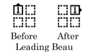
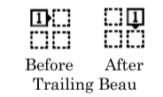
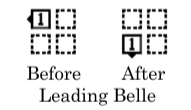
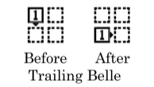

# Box Counter Rotate

From any 4-dancer formation with no dancers facing the flagpole center [At
Advanced, this call is used only from a 2X2 formation, e.g. Box Circulate]:
This call may have a fraction after it, such as Box Counter Rotate 3/4. If no fraction is
given, it means Box Counter Rotate 1/4.

For each 1/4 in the fraction: Each dancer moves his position in the formation forward
around the center of the formation 90°, by walking forward in a smooth arc to reach that
spot. Each dancer works independently of the other 3 dancers in his formation.

Every dancer can [Roll](../plus/anything_and_roll.md) at the end of this call.

The diagrams below show the beginning and ending positions for a single dancer, for
every spot in a box circulate formation.

Example -- Box Counter Rotate 1/4:

> 
> 
> 

Example—Box Counter Rotate 3/4:

> 
> 
> 

For Teaching: Think of this as Promenading 1/4 in the formation; that captures the
smoothness of the call. You can also have the leads [Quarter In](../a1/quarter_in.md) and
[Box Circulate](../b1/circulate.md), while the trailers [ Box Circulate](../b1/circulate.md) and
[Quarter In](../a1/quarter_in.md). That gets the dancers to the right place.

Timing: 4

###### @ Copyright 1982, 1986-1988, 1995, 2001-2020. Bill Davis, John Sybalsky, and CALLERLAB Inc., The International Association of Square Dance Callers. Permission to reprint, republish, and create derivative works without royalty is hereby granted, provided this notice appears. Publication on the Internet of derivative works without royalty is hereby granted provided this notice appears. Permission to quote parts or all of this document without royalty is hereby granted, provided this notice is included. Information contained herein shall not be changed nor revised in any derivation or publication.
