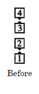
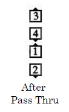
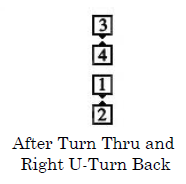

# Pass and Roll Your Neighbor

Timing: 12

From single eight chain thru: All [Pass Thru](../b1/pass_thru.md). The centers
[Turn Thru](../ms/turn_thru.md) while the outsides
do a right-face [U-Turn Back](../b1/turn_back.md). 
All [Pass Thru](../b1/pass_thru.md), and the centers [Touch 3/4](../b2/touch_a_quarter.md) while the outsides
finish as in [Follow Your Neighbor](../plus/follow_your_neighbor.md)
([Fold](../ms/fold.md) right, [Roll](../plus/anything_and_roll.md), and step slightly forward). Ends in a
left-hand wave.

> 
> 
> 

###### @ Copyright 1982, 1986-1988, 1995, 2001-2020. Bill Davis, John Sybalsky, and CALLERLAB Inc., The International Association of Square Dance Callers. Permission to reprint, republish, and create derivative works without royalty is hereby granted, provided this notice appears. Publication on the Internet of derivative works without royalty is hereby granted provided this notice appears. Permission to quote parts or all of this document without royalty is hereby granted, provided this notice is included. Information contained herein shall not be changed nor revised in any derivation or publication.
