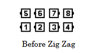
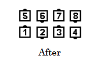
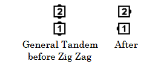
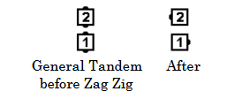

# Zig Zag and variations

Timing: 2

From a General Tandem or General Column:

“Zig” means Face Right, and “Zag” means Face Left, 
but neither “Zig” nor “Zag” is used by itself as a call.

If two actions are given in a single call 
(the four possible combinations are Zig Zag, Zag Zig, Zig Zig, or Zag Zag),
each active dancer must be either a Leader or a Trailer.
Leaders do the first action while Trailers do the second action.

>
>
>
>

Three or more actions may be given in a single call
if columns of matching length are first identified.
The #1 dancers in each column do the first action,
#2 dancers do the second action, and so on.
Examples: “Columns of 4, Zag Zig Zig Zag”; “Columns of 3, Zig Zig Zag”.

From any General Tandem, Zig Zag produces a Right-Hand Mini-Wave,
and Zag Zig produces a Left-Hand Mini-Wave.

>
>
>
>

It follows that from a General Column, Zig Zag produces Right-Hand Waves, and Zag Zig produces
Left-Hand Waves. From General Lines, Zig Zag produces Right-Hand Columns, and Zag Zig
produces Left-Hand Columns.

*Historical Note:* Prior to 2025 the definition included this statement:
“If only one is given, it is directed to the leaders,
and the trailers do nothing. 
In 3/4 Tag the Line, Zig, only the outsides would Face Right.”
This usage is now improper.

###### @ Copyright 1982, 1986-1988, 1995, 2001-2023. Bill Davis, John Sybalsky, and CALLERLAB Inc., The International Association of Square Dance Callers. Permission to reprint, republish, and create derivative works without royalty is hereby granted, provided this notice appears. Publication on the Internet of derivative works without royalty is hereby granted provided this notice appears. Permission to quote parts or all of this document without royalty is hereby granted, provided this notice is included. Information contained herein shall not be changed nor revised in any derivation or publication.
