# Butterfly and O Concepts

Butterfly and O *formations* are similar to General Columns, 
but the dancers occupy 8 specific spots within a 4×4 grid, as shown below.

>
> 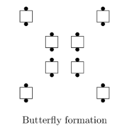
> 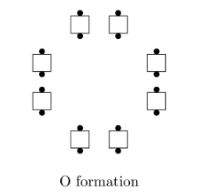
>

The Butterfly and O *concepts* specify that dancers treat the formation
as distorted General Columns
and do the specified call accordingly. 
The Butterfly concept can be used only when dancers are on
Butterfly spots; the O concept can be used only when dancers are on O spots.

The Butterfly and O concepts can only be used with calls that start from General Columns (Columns,
Double Pass Thru, Eight Chain Thru, etc.) and end in a 2×4 (General Lines, General Columns, or a
T-Bone 2×4). The ending formation will always match the result of the dancers adjusting by sliding
together as needed to make (undistorted) General Columns, doing the call normally, and then
adjusting as needed to collectively occupy the original Butterfly or O spots.

Examples:

>
> 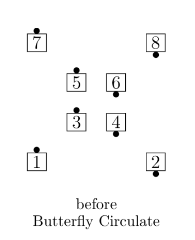
> 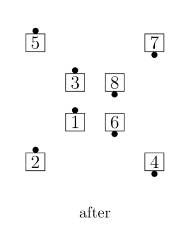
>
> 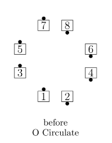
> 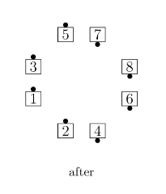
>
> 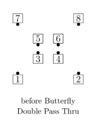
> 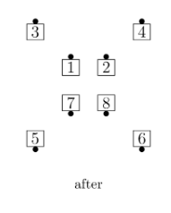
>
> 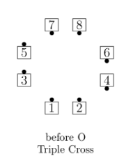
> 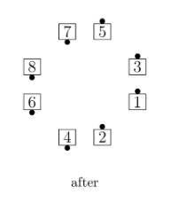
>

On Box calls such as Walk and Dodge or Split Counter Rotate (below), dancers should make sure to
work in their own (distorted) Box, as they would from ordinary (undistorted) Columns.

>
> 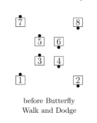
> 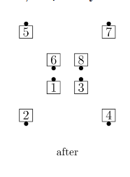
>
> 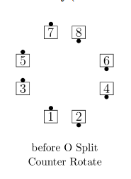
> 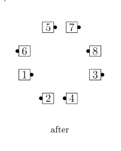
>

Simpler calls, such as those shown so far, are typically danced by moving directly to the existing
spots. For more complex calls, dancers usually blend an initial adjustment to an undistorted General
Columns formation with the initial actions of the call, and blend the final actions of the call with a
final adjustment from a 2×4 back to Butterfly or O spots. For the Butterfly concept, the new Ends
adjust outward; for the O concept, the new Centers adjust outward. In the first pair of examples
below, the adjustment is forward or backward from the nominal (undistorted) final 2×4 formation;
in the second pair it is sideways.

>
> 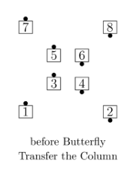
> 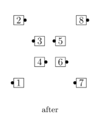
>
> 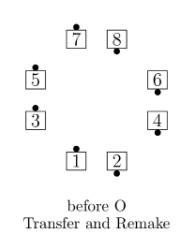
> 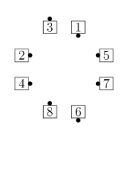
>
> 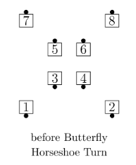
> 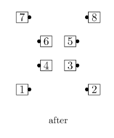
>
> 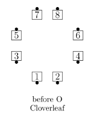
> 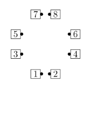
>

The Butterfly and O concepts always specify that the formation be treated as distorted General
Columns, not distorted General Lines or Waves. Wave calls, such as Swing Thru, can be used with
these concepts only if the call permits applying the Facing Couples Rule and the starting formation
is a Butterfly/O version of an Eight Chain Thru formation. On the calls shown below, the dancers
step to a Wave of appropriate handedness, then do the call normally, adjusting at the end to occupy
the original eight spots.

>
> 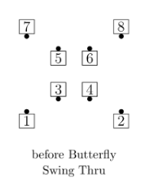
> 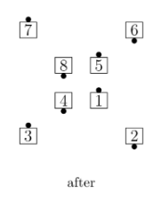
>
> 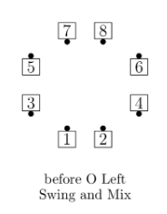
> 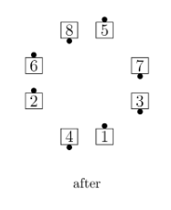
>

A few other calls can be used from a Butterfly or O formation but are not applications of the Butterfly
or O concepts and therefore do not necessarily end back on the same eight spots. Examples include
Squeeze, Squeeze the Butterfly, Squeeze the O, and Press Ahead. Callers should avoid phrases that
may be interpreted as applying the Butterfly or O concepts when this is not intended. If, for example,
the caller wishes to draw attention to the formation before using a call such as Press Ahead, a cue
such as “Check a Butterfly” or “You have an O” may be used. However, the expressions “In Your
Butterfly” or “In Your O” are typically interpreted as specifying the corresponding concept; they
should only be used if that concept is intended.

The terms “T-Bone Butterfly” and “T-Bone O” describe formations in which dancers are on Butterfly
Spots or O Spots but there are dancers, not necessarily adjacent, whose facing directions are
perpendicular. If the Butterfly or O Concept is used when dancers are in a T-Bone Butterfly or O,
each dancer works in their own Butterfly or O, as if the other dancers were not T-boned to them.
(See “[T-Bone Formation](t_bone_formation.md)” for a broader discussion of doing calls from T-Bone formations.)

>
> 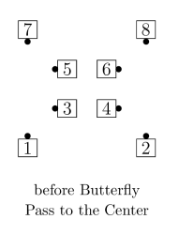
> 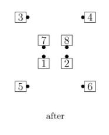
>
> 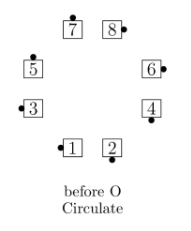
> 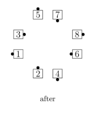
>

###### @ Copyright 1983, 1986-1988, 1995-2026 Bill Davis, John Sybalsky and CALLERLAB Inc., The International Association of Square Dance Callers. Permission to reprint, republish, and create derivative works without royalty is hereby granted, provided this notice appears. Publication on the Internet of derivative works without royalty is hereby granted provided this notice appears. Permission to quote parts or all of this document without royalty is hereby granted, provided this notice is included. Information contained herein shall not be changed nor revised in any derivation or publication.
