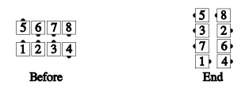

# Cast a Shadow

At C-1, you may call [Cast a Shadow](../a1/cast_a_shadow.md) from any general line in which the ends are
in tandem. In particular, it is allowed when all 4 centers are facing in; the centers part in that case
is Pass In and Pass Thru, finishing facing out as the centers of lines:

>
> 
>