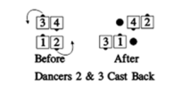

# Cast Back / Cross Cast Back

## Cast Back

From any formation with definite leads, who must not be
facing directly toward or away from the flagpole center:
Starting in a Tandem, the lead dancer always does the call;
elsewhere, the caller must designate a dancer. The
designated dancer does a
[Peel Off](../plus/peel_off.md) and steps forward to stand beside
the other dancer. The other dancer does not move. This call
cannot be fractionalized.

> 
> 
> 
>

## Cross Cast Back

From a couple facing out of a 2x2 formation: Starting in
Tandem Couples, the lead dancers always do the call;
elsewhere, the dancers must be designated. The designated
dancers [Trail Off](../a2/trail_off.md) and step forward to stand beside the
other dancers. The others do not move. This call cannot be
fractionalized.

>
> 
>

###### @ Copyright 1983, 1986-1988, 1995-2022 Bill Davis, John Sybalsky and CALLERLAB Inc., The International Association of Square Dance Callers. Permission to reprint, republish, and create derivative works without royalty is hereby granted, provided this notice appears. Publication on the Internet of derivative works without royalty is hereby granted provided this notice appears. Permission to quote parts or all of this document without royalty is hereby granted, provided this notice is included. Information contained herein shall not be changed nor revised in any derivation or publication.
