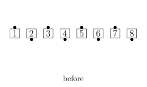
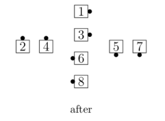
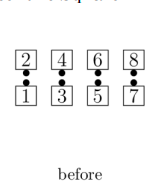
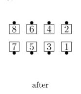
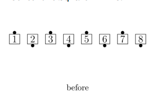

# Concentric Concept

From any appropriate formation (half the dancers must
be Centers and half must be Outsides): The Centers do the
call in their group, while the Outsides work with each
other and do the call around the outside. The 
diagrams show who works with whom on a Concentric
call:

> 
> 
> 

The last two formations shown are really the same; the
grouping on the left is used if the caller only says
"Concentric..." and the Concentric call can be done from a 1x4.
The grouping on the right is used when the caller says
"Concentric Diamond..." or when the Concentric
call can only be done from Diamonds (for example, "Concentric 
[Diamond Circulate](../plus/diamond_circulate.md)" or
"Concentric [Flip the Diamond](../plus/flip_the_diamond.md)").

If the Concentric call starts and ends in a 2x2
Box (for example, "Concentric Star Thru"), the following rule
applies: If the Outsides begin as though in Columns, they
finish as though in Columns; if they begin as though in Lines, they
finish as though in Lines.

Concentric [Star Thru](../b1/star_thru.md):

> 
> 
> 
> 
>

If the Concentric call ends in a 2x2 Box but starts
elsewhere (for example, "Concentric [Recycle](../ms/recycle.md)" from a Tidal Wave), the
following rule applies: The Outside dancers finish so that
the long axis of their ending formation is at right angles to
the long axis of their starting formation.

Concentric [Recycle](../ms/recycle.md):

> 
> 
>   

Concentric [Recycle](../ms/recycle.md):

>
> 
> 
>

Concentric [Reverse Explode](reverse_explode.md):

> 
> 
> 
> 

Concentric [Hinge](../ms/hinge.md):

> 
> 
> 
>

Concentric [Step and Fold](step_and_fold.md):

> 
> 
> 
> 

Concentric Diamonds, [ Step and Fold](step_and_fold.md):

> 
> 
> 
>

If the Concentric call does not end in a 2x2 Box, 
then it is not necessary to apply either of the
above rules. The Outsides simply finish in the outside 1x4 or Diamond.

Concentric [Trade the Wave](../plus/trade_the_wave.md):

>
> 
> 
>

Concentric [Recycle](../ms/recycle.md):

>
> 
> 
>

Concentric [Switch to a Diamond](../a2/switch_to_a_diamond.md):

> 
> 
>

If the Concentric call involves applying the [Ocean Wave Rule](../b2/ocean_wave_rule.md) or Facing Couples Rule, the
Concentric rules apply to the actual starting setup, not to any adjusted setup that might be
created or imagined while starting the call.

Concentric [Square Thru 3](../b1/square_thru.md):

>
> 
> 
>

Concentric [Square Thru 3](../b1/square_thru.md):

>
> 
> 
>

Common applications include:
- From starting Double Pass Thru: Concentric Star Thru, Concentric Slide Thru, Concentric Pass In,
  Concentric Pass Out, Concentric Touch 1/4
- From Completed Double Pass Thru: Concentric Chase Right, Concentric Shakedown
- From Tidal Wave: Concentric Recycle, Concentric Ah So
- From Tidal Line: Concentric Wheel and Deal, Concentric Turn and Deal, Concentric 1/2 Tag

###### @ Copyright 1983, 1986-1988, 1995-2023 Bill Davis, John Sybalsky and CALLERLAB Inc., The International Association of Square Dance Callers. Permission to reprint, republish, and create derivative works without royalty is hereby granted, provided this notice appears. Publication on the Internet of derivative works without royalty is hereby granted provided this notice appears. Permission to quote parts or all of this document without royalty is hereby granted, provided this notice is included. Information contained herein shall not be changed nor revised in any derivation or publication.
