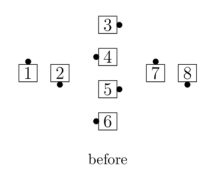
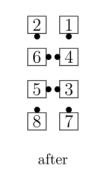

# Concentric Concept

From any appropriate formation (half the dancers must
be centers and half must be outsides): The centers do the
call in their group, while the outsides work with each
other and do the call around the outside. The 
diagrams show who works with whom on a Concentric
call:

> 
> 
> 

The last two formations shown are really the same; the
one on the left is used if the caller only says
"Concentric..." or the Concentric call doesn't start in
Diamonds. The one on the right is used when the caller
says "Concentric Diamond, ..." or when the Concentric
call can only be done from Diamonds (e.g., Concentric 
[Diamond Circulate](../plus/diamond_circulate.md)).

If the Concentric call is being done from General Lines or
General Columns, and the call starts and ends in a 2x2
Box, the following rule
applies: If the ends begin as though in Columns, they
finish as though in Columns; if they begin in Lines, they
finish in Lines.

For example, Concentric [Star Thru](../b1/star_thru.md):

> 
> 
> 
> 
>

If the Concentric call ends in a 2x2 Box but starts
elsewhere (for example, Concentric [Recycle](../ms/recycle.md) from a Tidal Wave), the
following rule applies: The outside dancers adjust so that
the long axis of the ending formation is at right angles to
the long axis of the starting formation.

Concentric [Recycle](../ms/recycle.md):

> 
> 
>   
> 
> 
>

Concentric [Crossfire](../plus/crossfire.md):

>
> 
> 
>

Concentric [Reverse Explode](reverse_explode.md):

> 
> 
> 
> 

Concentric Single [Hinge](../ms/hinge.md):

> 
> 
> 
>

Concentric [Trade the Wave](../plus/trade_the_wave.md):

>
> 
> 
>

Concentric [Step and Fold](step_and_fold.md):

> 
> 
> 
> 

Concentric Diamond, [ Step and Fold](step_and_fold.md):

> 
> 
> 
> 

Common applications include:
- From starting Double Pass Thru: Star Thru, Slide Thru, Pass In / Out, Touch 1/4
- From Completed Double Pass Thru: Chase Right, Shakedown
- From Tidal Wave: Recycle, Ah So
- From Tidal Line: Wheel and Deal, Turn and Deal, 1/2 Tag

###### @ Copyright 1983, 1986-1988, 1995-2021 Bill Davis, John Sybalsky and CALLERLAB Inc., The International Association of Square Dance Callers. Permission to reprint, republish, and create derivative works without royalty is hereby granted, provided this notice appears. Publication on the Internet of derivative works without royalty is hereby granted provided this notice appears. Permission to quote parts or all of this document without royalty is hereby granted, provided this notice is included. Information contained herein shall not be changed nor revised in any derivation or publication.
