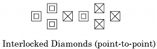

# Interlocked Diamond Formation

Two adjacent Diamonds in which the very centers work with the
furthest other 3 dancers.

> 
>       
> 
>   
> 

## Interlocked Diamond Circulate

Diamond Circulate to the next position in your Interlocked Diamond.

> 
> 
>   
> 
> 
> 
> 

## Cut the Interlocked Diamond

From Interlocked Diamonds (Twin): The points
[Cut the Diamond](../plus/cut_the_diamond.md), while the centers
Interlocked Diamond Circulate.

>
> 
>

## Flip the Interlocked Diamond

From Interlocked Diamonds (Twin): The points
[Flip the Diamond](../plus/flip_the_diamond.md), while the centers
Interlocked Diamond Circulate.

>
> 
>

###### @ Copyright 1983, 1986-1988, 1995-2023 Bill Davis, John Sybalsky and CALLERLAB Inc., The International Association of Square Dance Callers. Permission to reprint, republish, and create derivative works without royalty is hereby granted, provided this notice appears. Publication on the Internet of derivative works without royalty is hereby granted provided this notice appears. Permission to quote parts or all of this document without royalty is hereby granted, provided this notice is included. Information contained herein shall not be changed nor revised in any derivation or publication.
