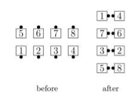
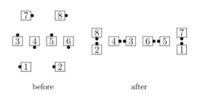

# Regroup

From Parallel Lines or any other formation
in which the Centers are Couples or Mini-Waves and
the Outsides can act as Ends of Lines: 
The Centers Trade and Roll while the Outsides Quarter
Out, Trade, and ["O" Circulate](o_formation.md). 
(See “When the Formation Isn’t There”, page 8, for the interpretation
of Ends of Lines and O Circulate when the formation isn’t a 2×4.) 
From Parallel Lines, Regroup ends in Facing Lines.

> 
> 
> 
> 

###### @ Copyright 1983, 1986-1988, 1995-2024 Bill Davis, John Sybalsky and CALLERLAB Inc., The International Association of Square Dance Callers. Permission to reprint, republish, and create derivative works without royalty is hereby granted, provided this notice appears. Publication on the Internet of derivative works without royalty is hereby granted provided this notice appears. Permission to quote parts or all of this document without royalty is hereby granted, provided this notice is included. Information contained herein shall not be changed nor revised in any derivation or publication.
