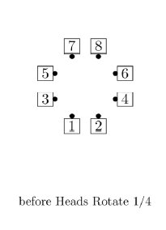
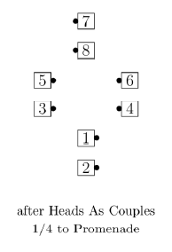
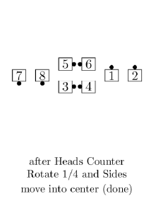
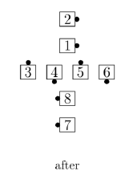
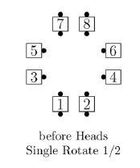
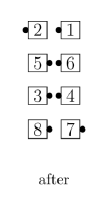
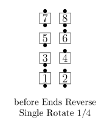
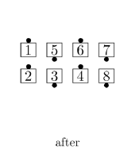

# Rotate Family

At C-1, the following calls are used only from a Static Square or any other formation in which the
designated dancers can act as Ends of General Columns (see "When the Formation Isn’t There",
page 8). The designated dancers must be named explicitly to avoid confusion with other Rotate
applications that involve all 8 dancers (not part of the C-1 program).
* For Rotate and Reverse Rotate, the designated dancers must be Couples.
* For Single Rotate and Reverse Single Rotate, 
the designated dancers must be Couples or in Mini-Waves.
* These calls all include a fraction, which is required.

## Rotate / Reverse Rotate

### Rotate 1/4, 1/2, 3/4

Working As Couples, the designated dancers turn
1/4 in place to face promenade direction and
[Counter Rotate](../a2/box_counter_rotate.md)
the given fraction around the outside of the square, 
while the other dancers move into the middle
if they are not already there.

> 
> 
> 

### Reverse Rotate 1/4, 1/2, 3/4

Working As Couples, the designated
outside dancers turn 1/4 in place to face reverse
promenade direction and [Counter Rotate](../a2/box_counter_rotate.md) the given
fraction around the outside of the square,
while the other dancers move into the middle
if they are not already there.

>
> !
>

## Single Rotate / Reverse Single Rotate

### Single Rotate 1/4, 1/2, 3/4

Working individually, the designated dancers
turn 1/4 in place to face promenade direction and
[Counter Rotate](../a2/box_counter_rotate.md)
the given fraction around the outside of the square,
while the other dancers move into the middle
if they are not already there.

>
> !
>

### Reverse Single Rotate 1/4, 1/2, 3/4

Working individually, the designated dancers turn 1/4 in place 
to face reverse promenade direction and
[Counter Rotate](../a2/box_counter_rotate.md) the given
fraction around the outside of the square,
while the other dancers move into the middle
if they are not already there.

>
> !
>

###### @ Copyright 1983, 1986-1988, 1995-2023 Bill Davis, John Sybalsky and CALLERLAB Inc., The International Association of Square Dance Callers. Permission to reprint, republish, and create derivative works without royalty is hereby granted, provided this notice appears. Publication on the Internet of derivative works without royalty is hereby granted provided this notice appears. Permission to quote parts or all of this document without royalty is hereby granted, provided this notice is included. Information contained herein shall not be changed nor revised in any derivation or publication.
