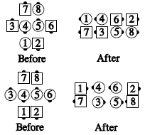

# Scoot and Ramble / Ramble

## Ramble

Parts: 2

From a 1/4 Tag or 3/4 Tag:
***The Outsides separate*** and
***[Slide Thru](../ms/slide_thru.md)*** with each other, while
***the Centers [Single Wheel](../a2/single_wheel.md)*** and
***[Slide Thru](../ms/slide_thru.md)***.

>
> 
> 

## Scoot and Ramble

Parts: 3

From 1/4 tag:
***[Scoot Back](../ms/scoot_back.md)***,
then ***Ramble***.  
Note: This call is defined to have 3 parts: the Scoot Back and the 2 parts of Ramble.

###### @ Copyright 1983, 1986-1988, 1995-2026 Bill Davis, John Sybalsky and CALLERLAB Inc., The International Association of Square Dance Callers. Permission to reprint, republish, and create derivative works without royalty is hereby granted, provided this notice appears. Publication on the Internet of derivative works without royalty is hereby granted provided this notice appears. Permission to quote parts or all of this document without royalty is hereby granted, provided this notice is included. Information contained herein shall not be changed nor revised in any derivation or publication.

<!-- Parts
Ramble1
Ramble2
Ramble1
Ramble2
ScootandRamble1
ScootandRamble2
-->