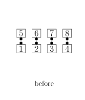
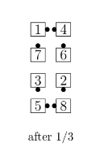
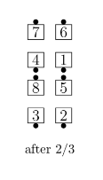
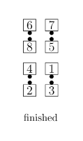

# Square the Bases

From Facing Lines: (This call has 3 parts.)
1. Centers [Square Thru 3](../b1/square_thru.md) while the Ends [Pass Thru](../b1/pass_thru.md) and [Ends Bend](../a1/ends_bend.md) 
2. [Split Square Thru 2](../a1/split_square_thru.md)
3. [Trade By](../b2/trade_by.md).
Ends in an Eight Chain Thru formation.

> 
> 
> 
> 
> 
>

## Square the Bases But \<anything>

Callers have historically used "Square the Bases But \<anything>" 
in a variety of ways, including replacing the Centers’ final part, 
replacing the Split Square Thru 2, or replacing the Split Square Thru 2 
and the Trade By. With the adoption of the general "But" modifier in 2023
(see [But](but.md)), callers are expected to use "Square the Bases But \<anything>" 
only to replace the Centers’ final part (Pass Thru). 
Callers should use other terminology for other replacements,
such as "Square the Bases, Replace the Split Square Thru 2 with \<anything>." 
Callers may also refer to the numbered parts; for example, 
"Square the Bases, Replace the second part with \<anything>," or 
"Square the Bases, Replace the last two parts with \<anything>."

###### @ Copyright 1983, 1986-1988, 1995-2023 Bill Davis, John Sybalsky and CALLERLAB Inc., The International Association of Square Dance Callers. Permission to reprint, republish, and create derivative works without royalty is hereby granted, provided this notice appears. Publication on the Internet of derivative works without royalty is hereby granted provided this notice appears. Permission to quote parts or all of this document without royalty is hereby granted, provided this notice is included. Information contained herein shall not be changed nor revised in any derivation or publication.
