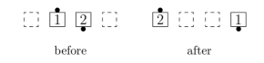
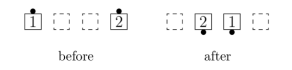
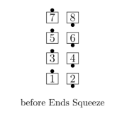
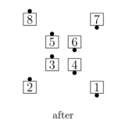
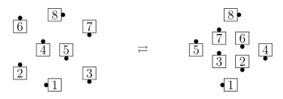
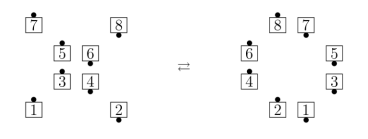
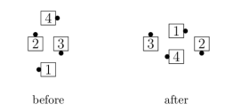

# Squeeze Family

## Squeeze

From two dancers side-by-side, either directly adjacent or separated: 
If the dancers are adjacent, they Trade and slide apart; 
if they are separated, they slide together and Trade. 
When this call is given to multiple pairs of dancers
whose paths cross (such as in a Diamond), the
adjacent dancers move first.

>
> 
> 
>

>
> 
> 
>

## Squeeze the  Galaxy / Hourglass

From a Galaxy / Hourglass: The three pairs of dancers
who are all facing the same set of walls
(head walls or side walls) Squeeze; the other two dancers
do not move. A Galaxy becomes an
Hourglass, and vice versa.

>
> 
>

## Squeeze the Butterfly / O

From a Butterfly / O: All Squeeze. A Butterfly becomes an O, and vice versa.

>
> 
>

## Squeeze the Diamond

From a Diamond: The Centers Squeeze and the Points Squeeze. 
Because of the crossing paths, the Centers move first.

>
> 
>

When Squeeze the Diamond is directed to 8 dancers, 
Twin Diamonds become Point-to-Point Diamonds, and vice versa.

###### @ Copyright 1983, 1986-1988, 1995-2024 Bill Davis, John Sybalsky and CALLERLAB Inc., The International Association of Square Dance Callers. Permission to reprint, republish, and create derivative works without royalty is hereby granted, provided this notice appears. Publication on the Internet of derivative works without royalty is hereby granted provided this notice appears. Permission to quote parts or all of this document without royalty is hereby granted, provided this notice is included. Information contained herein shall not be changed nor revised in any derivation or publication.
