# T-Bone Formation

"T-Bone" (or "T-Boned") describes any formation that contains
two adjacent dancers whose facing directions are perpendicular.

For example:

>
> 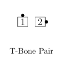
> 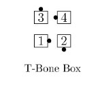
> 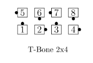
>

Many other examples are possible, including 
different sets of facing directions and different overall
formations (such as T-Bone 1×4,T-Bone 1×8).

To dance a call from a T-Bone formation, 
each dancer does their part of the call as they would from
a non-T-Bone formation of the same shape.
However, the ending formation may be different.

>
> 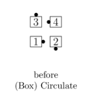
> 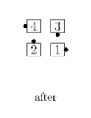
> 
> 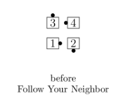
> 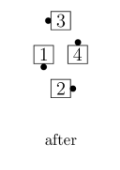
>

As shown in the call names above, the caller will
usually just give the call name and not actually
say “T-Bone”. “T-Bone” is simply a formation description,
not the name of a concept or part of a call name.
“T-Bone” may be used as part of a cue, such as
“You’re T-boned”, and dancers are expected to know what this means.
In a T-Bone 2×4, some dancers are in General Lines
and others are in General Columns. To do a call 
from these formations, some dancers find it helpful
to explicitly think about being in Lines or Columns.

>
> 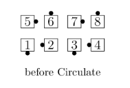
> 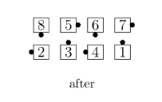
>
> 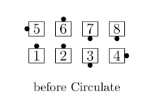
> 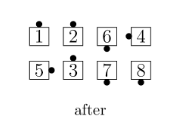
>

The call “1/2 Circulate” can be difficult from a T-Bone setup.
Dancers going “around the corner” for their Circulate path
must carefully walk in an arc around those walking
straight ahead to ensure taking the correct hands
with the dancers they meet.
This is not an instance of the Same Position Rule.

>
> 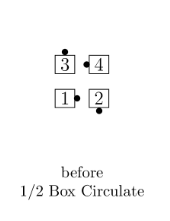
> 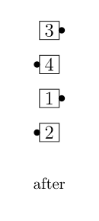
>
> 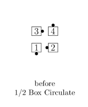
> 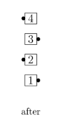
>
> 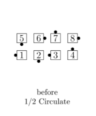
> 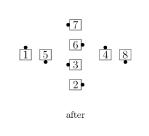
>

###### @ Copyright 1983, 1986-1988, 1995-2026 Bill Davis, John Sybalsky and CALLERLAB Inc., The International Association of Square Dance Callers. Permission to reprint, republish, and create derivative works without royalty is hereby granted, provided this notice appears. Publication on the Internet of derivative works without royalty is hereby granted provided this notice appears. Permission to quote parts or all of this document without royalty is hereby granted, provided this notice is included. Information contained herein shall not be changed nor revised in any derivation or publication.
