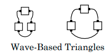
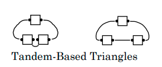

# Triangle Formation / Triangle Circulate

## Triangle Formation

A Triangle is a formation of 3 dancers. 
One is the apex and the other two form the base.
The apex dancer must be the same distance from each of the base dancers.
If the base dancers are aligned in a General Column, 
the triangle is called a Tandem-Based Triangle. If the base
dancers are aligned in a General Line, 
the triangle is called a Wave-Based Triangle. In some triangles all 3
dancers may not be adjacent to each other. 
Triangles are found as parts of a Galaxy,
Hourglass, Twin Diamonds and various other formations.

## Triangle Circulate
From a Triangle: Each dancer moves forward one position
along one of the circulate paths shown below:

> 
> 
> 
> 

*Teaching Hint:* Every dancer has one shoulder toward the
inside of the triangle. After Triangle Circulate, that same
shoulder is still toward the center.

Note: On Triangle Circulate from a T-Bone Triangle 
(base dancers are T-Boned to each other), base dancers
use their own starting position to determine whether to treat the Triangle
as Tandem-Based or Wave-Based,
whereas Apex dancers use the starting position of the spot
to which they Circulate.

## Inside / Outside Triangles
Various formations, including Twin Diamonds and Point-to-Point Diamonds,
contain Triangles

**Inside Triangle**: The Center 6 form the Triangles.

> 
> 
> 
> 
> 

**Outside Triangle**: The Outside 6 form the Triangles.

> 
> 
> 
> 

## Inpoint / Outpoint Triangles
The footprints of Twin Diamonds, with the outside 4 in Tandem, 
contain additional Triangles. Each of
these triangles has one point as the apex and two of the center 4 as the base.

**Inpoint Triangle**:Each point facing in is an Apex.

> 
> 
> 
> 

**Outpoint Triangle**: Each point facing out is an Apex.

> 
> 
> 
> 

## Tandem-based / Wave-based Triangles
Various formations, especially a Galaxy, contain triangles that may be
identified by the formation of their “base”. A Wave-Based Triangle has
the dancers in the base usually in a Mini-Wave (also possible: a
Couple). A Tandem-Based Triangle has the dancers in the base usually in
a tandem (also possible: Facing or Back-to-Back dancers).

> 
> 
> 
> 

Examples of various Triangle Circulates:

> 
> 
> 
> 
> 
> 

###### @ Copyright 1983, 1986-1988, 1995-2024 Bill Davis, John Sybalsky and CALLERLAB Inc., The International Association of Square Dance Callers. Permission to reprint, republish, and create derivative works without royalty is hereby granted, provided this notice appears. Publication on the Internet of derivative works without royalty is hereby granted provided this notice appears. Permission to quote parts or all of this document without royalty is hereby granted, provided this notice is included. Information contained herein shall not be changed nor revised in any derivation or publication.
