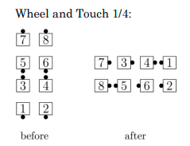
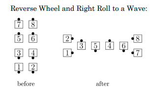
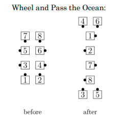
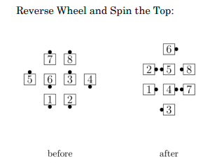

# Wheel and \<anything>

## Wheel and \<anything>

From any formation in which exactly two couples are facing directly
away from the center of the
set with no one in front of them: The couples facing out
Promenade 1/4, ending facing in, while
the other dancers move into the center (if necessary) and do the \<anything> call.

## Reverse Wheel and \<anything>

From any formation in which exactly two couples are facing directly
away from the center of the
set with no one in front of them: The couples facing out Wrong Way Promenade 1/4,
ending facing in, while the other dancers move into the center (if necessary)
and do the \<anything> call.

>
> 
> 
>

>
> 
> 
>

###### @ Copyright 1983, 1986-1988, 1995-2022 Bill Davis, John Sybalsky and CALLERLAB Inc., The International Association of Square Dance Callers. Permission to reprint, republish, and create derivative works without royalty is hereby granted, provided this notice appears. Publication on the Internet of derivative works without royalty is hereby granted provided this notice appears. Permission to quote parts or all of this document without royalty is hereby granted, provided this notice is included. Information contained herein shall not be changed nor revised in any derivation or publication.
