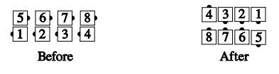

# 3 by 1 Checkmate the Column

From Columns: The first 3 dancers in each Column
[Circulate](../b1/circulate.md) 4 spots and Face In, while #4 in each Column
Circulate 3 times, Face In, and Circulate. Finishes in
Parallel 3-and-1 Lines.

>
> 
>

###### @ Copyright 1983, 1986-1988, 1995-2024 Bill Davis, John Sybalsky and CALLERLAB Inc., The International Association of Square Dance Callers. Permission to reprint, republish, and create derivative works without royalty is hereby granted, provided this notice appears. Publication on the Internet of derivative works without royalty is hereby granted provided this notice appears. Permission to quote parts or all of this document without royalty is hereby granted, provided this notice is included. Information contained herein shall not be changed nor revised in any derivation or publication.
