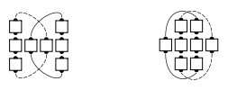

# 3 by 1 Triangle Formation / Circulate

## 3 by 1 Triangle Formation

A 3 by 1 Triangle is a triangle with three dancers forming the base and one
dancer in the apex.

## 3 by 1 Triangle Circulate

Move forward one position along the circulate path shown.

> 
> 
> 

## Interlocked 3 by 1 Triangle Circulate

From a quarter tag, an "H", etc.: Move forward one spot along the
circulate path shown:

> 
> 
> 

###### @ Copyright 1983, 1986-1988, 1995-2022 Bill Davis, John Sybalsky and CALLERLAB Inc., The International Association of Square Dance Callers. Permission to reprint, republish, and create derivative works without royalty is hereby granted, provided this notice appears. Publication on the Internet of derivative works without royalty is hereby granted provided this notice appears. Permission to quote parts or all of this document without royalty is hereby granted, provided this notice is included. Information contained herein shall not be changed nor revised in any derivation or publication.
