# Cross-Concentric Concept

From any appropriate formation (there must be a Center Four):
The Center Four do
the call in their group and move to the outside, while the Outsides work with
each other and do the call as they move into the center. The diagrams
show who works with whom on a Cross-Concentric call: 

> 
> 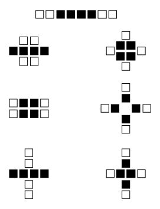
> 

The last two formations shown are really the same; the grouping on the left is
used if the caller only says "Cross-Concentric..."
and the Cross Concentric call
can be done from a 1x4. The grouping on the right is used
when the caller says "Cross-Concentric Diamond..." or when the
Cross-Concentric call can only be done from Diamonds 
(for example, "Cross-Concentric Diamond Circulate" or 
"Cross Concentric Flip the Diamond"). 

If the Cross-Concentric call starts and ends in a 2x2 Box (for example, 
"Cross-Concentric Star Thru"), the following rule applies: If the original
Centers begin as though in Columns,
they finish (on the outside) as though in Columns;
if they begin in Lines, they finish
as though in Lines.

Cross-Concentric [Star Thru](../b1/star_thru.md):

>
> 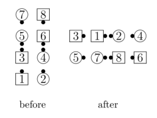
> 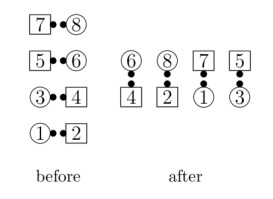
> 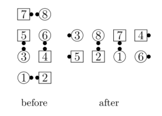
> 

If the Cross-Concentric call ends in a 2x2 Box but starts
elsewhere (for example, "Cross-Concentric [Recycle](../ms/recycle.md)" from a Tidal Wave),
the following rule applies: 
The new Outside dancers (the original Centers) finish so that the long
axis of their resulting (disconnected) Box is at right angles
to the long axis of their
4-dancer starting formation.

Cross-Concentric [Wheel and Deal](../b2/wheel_and_deal.md):

> 
> 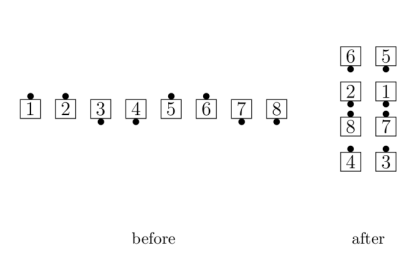
> 
> 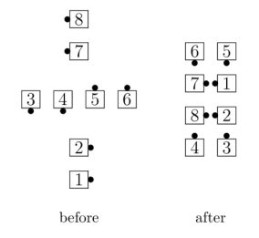
> 

Cross-Concentric [Recycle](../ms/recycle.md):

>
> 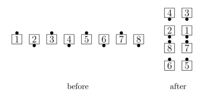
> 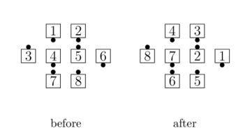
> 

Cross-Concentric [Reverse Explode](../c1/reverse_explode.md): 

> 
> 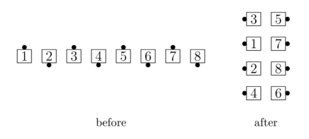
> 

Cross-Concentric [Hinge](../ms/hinge.md): 

> 
> 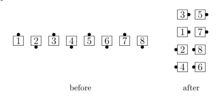
> 

Cross-Concentric Diamonds, [Flip the Diamond](../plus/flip_the_diamond.md)

> 
> 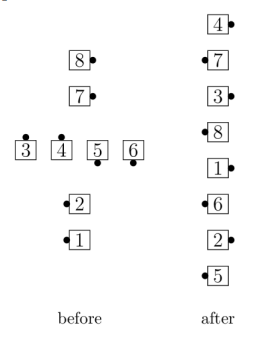
> 

Cross-Concentric Diamonds, [Drop In](../c2/drop_in.md):

> 
> 
> 

###### @ Copyright 1983, 1986-1988, 1995-2022 Bill Davis, John Sybalsky and CALLERLAB Inc., The International Association of Square Dance Callers. Permission to reprint, republish, and create derivative works without royalty is hereby granted, provided this notice appears. Publication on the Internet of derivative works without royalty is hereby granted provided this notice appears. Permission to quote parts or all of this document without royalty is hereby granted, provided this notice is included. Information contained herein shall not be changed nor revised in any derivation or publication.
