# Cross-Concentric Concept

From any appropriate formation (there must be a Center Four):
The Center Four do
the call in their group and move to the outside,
while the Outsides work with
each other and do the call as they move into the center.
The first set of diagrams, showing seven starting
formations, illustrates who works with whom on a Cross
Concentric call. These are not the only possibilities;
other starting formations may be used, as long as it is
clear which dancers work together and each group can
do the specified call.

> 
> 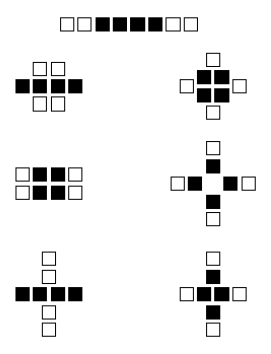
> 

The bottom two formations shown are really the same;
the grouping on the left is
used if the caller only says "Cross-Concentric..."
and the Cross Concentric call
can be done from a 1x4. The grouping on the right is used
when the caller says "Cross-Concentric Diamond..." or when the
Cross-Concentric call can only be done from Diamonds 
(for example, "Cross-Concentric Diamond Circulate" or 
"Cross Concentric Drop In"). 

If the Cross-Concentric call starts and ends in a 2x2 Box (for example, 
"Cross-Concentric Star Thru"), the following rule applies: If the original
Centers begin as though in Columns,
they finish (on the outside) as though in Columns;
if they begin in Lines, they finish
as though in Lines.

Cross-Concentric [Star Thru](../ms/star_thru.md):

>
> 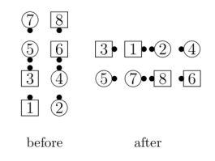
> 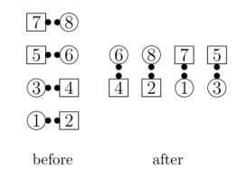
> 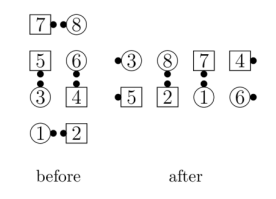
> 

If the Cross-Concentric call ends in a 2x2 Box but starts
elsewhere (for example, "Cross-Concentric [Recycle](../ms/recycle.md)" from a Tidal Wave),
the following rule applies: 
The new Outside dancers (the original Centers) finish so that the long
axis of their resulting (disconnected) Box is at right angles
to the long axis of their
4-dancer starting formation.

Cross-Concentric [Wheel and Deal](../ms/wheel_and_deal.md):

> 
> 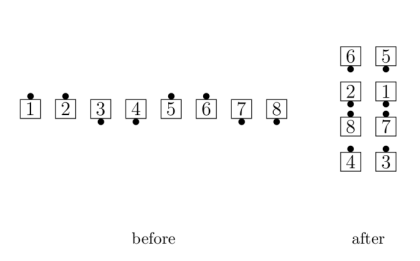
> 
> 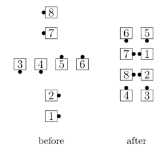
> 

Cross-Concentric [Recycle](../ms/recycle.md):

>
> 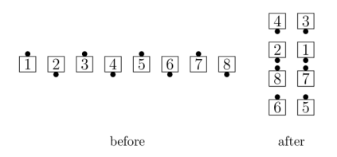
> 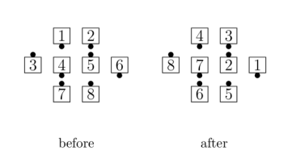
> 

Cross-Concentric [Reverse Explode](../c1/reverse_explode.md): 

> 
> 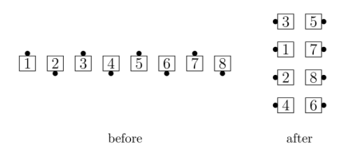
> 

Cross-Concentric [Hinge](../ms/hinge.md): 

> 
> 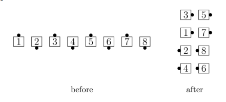
> 

Cross-Concentric Diamonds, [Flip the Diamond](../plus/flip_the_diamond.md)

> 
> 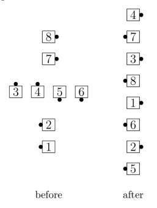
> 

Cross-Concentric Diamonds, [Drop In](../c2/drop_in.md):

> 
> 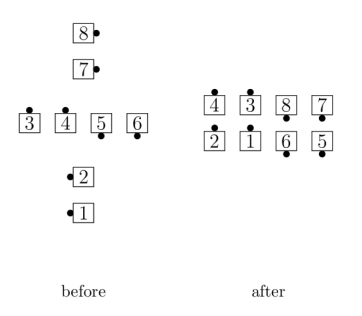
>

If the Cross Concentric call involves applying
the Ocean Wave Rule or Facing Couples Rule,
the Cross Concentric rules apply to the actual starting formation,
not to any adjusted formation that might be created or imagined
while starting the call.

Cross Concentric Square Thru 3:
>
> 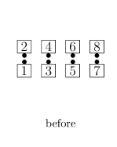
> 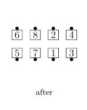
>

Cross Concentric Square Thru 3:
>
> 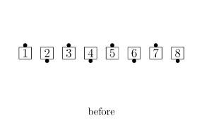
> 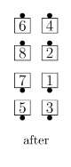
>

The following example begins from Concentric Z’s.
Dancers 3, 4, 5 and 6 are in the Center Z.
Concentric Z’s are not commonly used and can be
difficult for the dancers to see because a
Center Line, Wave, or Column is also present.
Caller judgment is required.

Cross Concentric Peel the Top
>
> 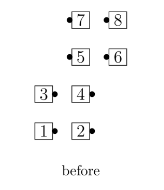
> 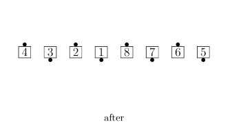
>

Calls commonly used with Cross Concentric include:
* From starting Double Pass Thru: Slide Thru, Square Thru, Swing Thru
* From Completed Double Pass Thru: Shakedown, Right Roll to a Wave, Turn to a Line
* From Tidal Wave: Recycle, Ah So, Spin the Top, Fan the Top
* From Tidal Line: Wheel and Deal, Turn and Deal, Half Tag, Tag Back

###### @ Copyright 1983, 1986-1988, 1995-2026 Bill Davis, John Sybalsky and CALLERLAB Inc., The International Association of Square Dance Callers. Permission to reprint, republish, and create derivative works without royalty is hereby granted, provided this notice appears. Publication on the Internet of derivative works without royalty is hereby granted provided this notice appears. Permission to quote parts or all of this document without royalty is hereby granted, provided this notice is included. Information contained herein shall not be changed nor revised in any derivation or publication.
