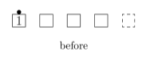
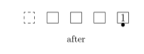
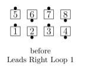
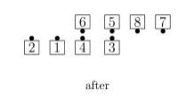
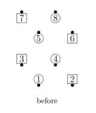
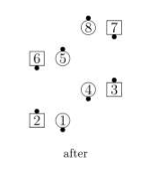
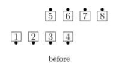
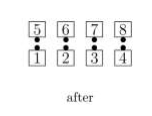

# Right / Left Loop 1, 2, 3

From any appropriate formation: Each designated dancer does a 
Run around \<N> adjacent positions, in the direction specified, 
and ending a distance of \<N>+1 positions from their starting position. 
Unlike Run, any non-designated dancers do not move. Any positions passed
may be occupied or unoccupied.

As an example, on "Right Loop 3", 
the designated dancer moves to the right, passing 3
positions, and ending a distance of 4 positions from where they started.

>
> 
> 
>

Loop is frequently used to get dancers into or out of 
specific formations, such as
Parallelograms, Offset formations, or Blocks. For example:

>
> 
> 
>

If the direction is “In” or “Out”, it refers to the initial direction
of the motion toward or away from the center of the overall set.

Boys In Loop 2:

>
> 
> 
>

The directions “In” or “Out” can only be used 
if no designated dancer is facing directly toward
or away from the center of the set.

If \<N> is zero, the dance action is the same as a Run
in the same direction (but, again, any
non-designated dancers do not move).

Everyone Left Loop 0:

>
> 
> 
>

The Same Position Rule does not apply; \<direction> Loop \<N> is not proper
if it would cause two dancers to occupy the same spot.

###### @ Copyright 1983, 1986-1988, 1995-2024 Bill Davis, John Sybalsky and CALLERLAB Inc., The International Association of Square Dance Callers. Permission to reprint, republish, and create derivative works without royalty is hereby granted, provided this notice appears. Publication on the Internet of derivative works without royalty is hereby granted provided this notice appears. Permission to quote parts or all of this document without royalty is hereby granted, provided this notice is included. Information contained herein shall not be changed nor revised in any derivation or publication.
