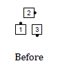
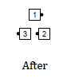
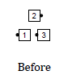
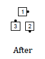
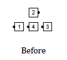
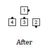

# Reshape the Triangle

From a Triangle: [Triangle Circulate](../c1/triangle_formation.md)
while changing the nature of the Triangle from Wave-Based to
Tandem-Based, or vice versa, and preserving handedness.
Those circulating to a base position
increase or decrease their turning amounts by 90 degrees, as described below.

From a Wave-Based Triangle: the dancer going to the apex circulates as usual,
the Apex circulates while turning 180 degrees,
and the other dancer circulates while turning only 90 degrees.

> 
> 
> 
> 

From a Tandem-Based Triangle: the dancer going to the apex
circulates as usual,
the Apex circulates while turning only 90 degrees,
and the other dancer circulates while turning 90 degrees
to face toward the apex.

> 
> 
> 
> 

Notes about Reshape the Triangle:

Because most formations with Triangles actually contain multiple triangles,
it is common practice to first identify the Triangles,
and then call “Reshape the Triangle” or simply “Reshape”. For example,
"Inside Triangles, Reshape".

**3 by 2 Reshape** is an extension of 3 by 2 Acey Deucey
in which dancers replace Triangle Circulate by Reshape the Triangle.

The command "3x1 Triangle, Reshape" (or "Reshape the 3x1 Triangle") is proper
from a Tandem-based 3x1 Triangle and follows the rules
for Tandem-based Triangles above.

> 
> 
> 
> 

Some callers use Reshape the Triangle from T-Boned triangles.
Dancers complete the call after individually determining
whether to treat the Triangle as Wave-Based or Tandem-Based, as in
Triangle Circulate (Base dancers make this determination
by using their own facing direction and
Apex dancers by using the facing direction of the position
to which they move).

###### @ Copyright 1983, 1986-1988, 1995-2024 Bill Davis, John Sybalsky and CALLERLAB Inc., The International Association of Square Dance Callers. Permission to reprint, republish, and create derivative works without royalty is hereby granted, provided this notice appears. Publication on the Internet of derivative works without royalty is hereby granted provided this notice appears. Permission to quote parts or all of this document without royalty is hereby granted, provided this notice is included. Information contained herein shall not be changed nor revised in any derivation or publication.
