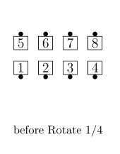
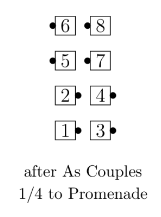
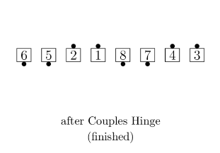
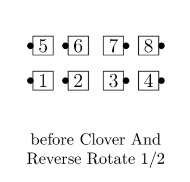
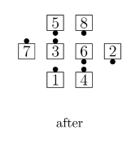
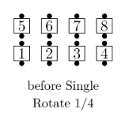
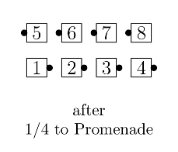
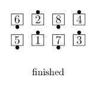
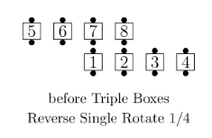
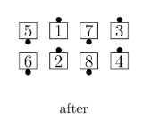

# Rotate Family

At C-2, the Rotate family of calls is extended
to include two additional starting formations:
a Box and Parallel Lines.

From a Box, the turning and Counter Rotate actions of the C-1 family are performed within
the Box, as described in more detail below. The Box may be designated explicitly (for example,
“Centers, Rotate 1/4”) or implicitly by using a call or concept that requires working in specific
Box(es), such as Triple Boxes, Blocks, or “Transfer and <anything>.”

From Parallel Lines, these calls are performed within each Box.

## Rotate / Reverse Rotate

### Rotate 1/4, 1/2, 3/4

From a Box composed of two Couples: Working As Couples, Turn 1/4 in place toward
Promenade direction (giving a Left-Hand Two-Faced Line). That new line does a
Couples Hinge once for each 1/4 of the given fraction.

### Reverse Rotate 1/4, 1/2, 3/4

From a Box composed of two Couples: Working As Couples, Turn 1/4 in place toward
Reverse Promenade direction (giving a Right-Hand Two-Faced Line). That new line
does a Couples Hinge once for each 1/4 of the given fraction.

Examples:

>
> 
> 
> 
>
> 
> 
> 

## Single Rotate / Reverse Single Rotate

### Single Rotate 1/4, 1/2, 3/4

From any Box of 4: Working individually, Turn 1/4 in place toward Promenade
direction, then Box Counter Rotate the given fraction.

### Reverse Single Rotate 1/4, 1/2, 3/4

From any Box of 4: Working individually Turn 1/4 in place toward Reverse Promenade
direction, then Box Counter Rotate the given fraction.

>
> 
> 
> 
>
> 
> 
>

Note: At C-2, these calls may not be directed to all 8 dancers in General Columns without a
modifier to restrict the action to individual Boxes (for example, “Each Box, Rotate 1/4” or
“Triple Boxes, Single Rotate 1/4”). Without such a modifier, the dance action of these calls is
defined by a separate rule that is not part of the C-2 program. (Directing the call to only the
Ends of Columns, as defined at C-1, remains proper.)

Teaching Hint: These definitions use the phrase “Turn 1/4 in place toward (Reverse)
Promenade direction” for consistency with the C-1 Definitions. However, when focusing on a
Box, Promenade direction can be less obvious. Some callers teach “Turn 1/4 in place toward
Promenade direction” as Zag Zig or as “throw your left hand into the Box.”

###### @ Copyright 1983, 1986-1988, 1995-2026 Bill Davis, John Sybalsky and CALLERLAB Inc., The International Association of Square Dance Callers. Permission to reprint, republish, and create derivative works without royalty is hereby granted, provided this notice appears. Publication on the Internet of derivative works without royalty is hereby granted provided this notice appears. Permission to quote parts or all of this document without royalty is hereby granted, provided this notice is included. Information contained herein shall not be changed nor revised in any derivation or publication.
