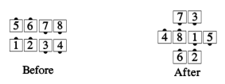
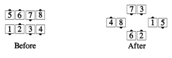

# Sets in Motion

From General Lines in which the centers are not all facing in:
Centers Hinge, then the new very centers Trade; all original centers
Roll, making a Column of 4. Meanwhile, the original ends Circulate 1
1/2 and any dancers who line up with the column of 4 Face In so the
center column has four to eight dancers. The center column dancers,
who must be facing the center of the set, walk forward, passing
right shoulders, until the first dancers Peel Left and second
dancers Peel Right, to finish as in-facing couples separated only by
any other column dancers, who remain in the center and finish
holding right hands with another center.

> 
> 
> 

If no outsides join the center column, then after the Peel Left and Peel Right,
the final formation has Facing Couples in the center with Right-Hand Mini-Waves
to their left and right.

>
> 
>

###### @ Copyright 1983, 1986-1988, 1995-2021 Bill Davis, John Sybalsky and CALLERLAB Inc., The International Association of Square Dance Callers. Permission to reprint, republish, and create derivative works without royalty is hereby granted, provided this notice appears. Publication on the Internet of derivative works without royalty is hereby granted provided this notice appears. Permission to quote parts or all of this document without royalty is hereby granted, provided this notice is included. Information contained herein shall not be changed nor revised in any derivation or publication.
