# Stagger Concept

Stagger *formations* are similar to General Columns,
but the dancers occupy the same spots as Blocks:

>
> 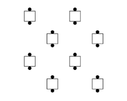
> 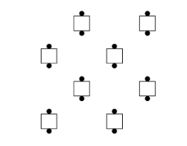
>

The Stagger *concept* specifies that dancers treat
the formation as distorted General Columns
and do the specified call accordingly,
similar to the Butterfly and O concepts.

The Stagger concept can only be used
with calls that start from General Columns (Columns,
Double Pass Thru, Eight Chain Thru, etc.)
and end in a 2×4 (General Lines, General
Columns, or a T-Bone 2×4).
The ending formation will always match the result of the dancers
adjusting by sliding together as needed
to make (undistorted) General Columns, doing the
call normally, and then adjusting
as needed to collectively occupy the original Stagger spots.

Examples:

>
> 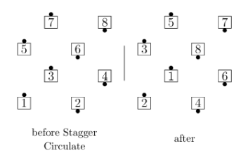
> 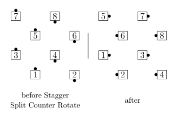
> 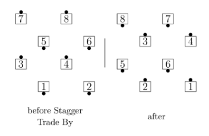
> 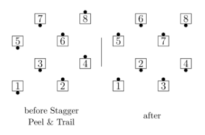
>

As with the Butterfly and O concepts, simpler calls are typically danced by moving directly
to the existing spots, and more complex calls are typically danced by blending into an
undistorted General Columns formation while starting the call. However, restoring the
formation at the conclusion of the call can be more difficult with Stagger than with Butterfly
or O, because dancers must remember which of the two possible Stagger formations they
started in. Many dancers do this by “remembering the diagonal” or remembering one of the
occupied corners of the 4×4 formation. Some dancers find it helpful to first complete the
underlying call to an ordinary (undistorted) 2×4 and then work as a team to remember the
diagonal and adjust to the original Stagger spots.

Examples of this process are shown below. Note that the final adjustment may be forward,
backward, or sideways. It can be helpful if the two dancers moving to the corners of the 4×4
raise their hand and move first, thereby establishing the diagonal. After this, it is easier to
determine others’ adjustments.

>
> 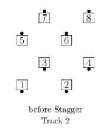
> 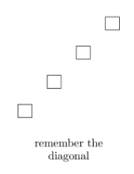
> 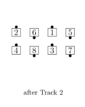
> 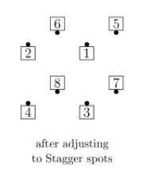
>
> 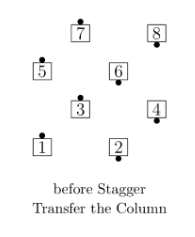
> 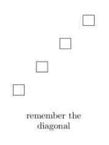
> 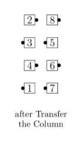
> 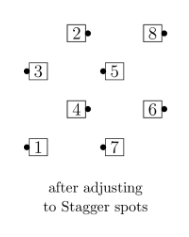
>
> 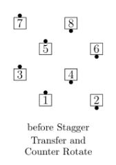
> 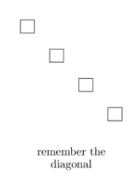
> 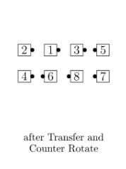
> 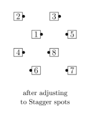
>

The Stagger concept always specifies that the formation be treated as distorted General
Columns, not distorted General Lines or Waves. Wave calls, such as Swing Thru, can be used
with Stagger only if the call permits applying the Facing Couples Rule and the starting
formation is a Stagger version of an Eight Chain Thru formation.

###### @ Copyright 1983, 1986-1988, 1995-2026 Bill Davis, John Sybalsky and CALLERLAB Inc., The International Association of Square Dance Callers. Permission to reprint, republish, and create derivative works without royalty is hereby granted, provided this notice appears. Publication on the Internet of derivative works without royalty is hereby granted provided this notice appears. Permission to quote parts or all of this document without royalty is hereby granted, provided this notice is included. Information contained herein shall not be changed nor revised in any derivation or publication.
