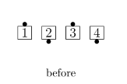
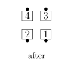
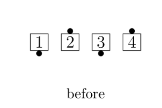
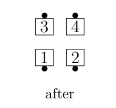
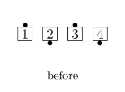
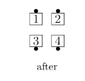
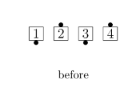
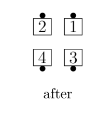

# Swap the Wave / Reverse Swap the Wave

## Swap the Wave

From a Right-Hand Wave: Centers step forward while the Ends
[Tag the Line](../plus/partner_tag.md)
Face Right, and step forward. Finishes as Back-to-Back Couples.

From a Left-Hand Wave: Ends Step Thru while the Centers 
Trade with each other and step forward. Finishes as Back-to-Back Couples.

>
> 
> 
> 
> 
> 
>

Note: The ending position of this call is the same
as the one obtained by stepping back
from the Wave and doing a Swap Around.

## Reverse Swap the Wave

From a Right-Hand Wave: Ends Step Thru
while the Centers Trade with each other and
step forward. Finishes as Back-to-Back Couples.

From a Left-Hand Wave: Centers step forward 
while the Ends Left Tag the Line, Face
Left, and step forward. Finishes as Back-to-Back Couples.

>
> 
> 
>
> 
> 
>

Note: The ending position of this call is the same
as the one obtained by stepping back
from the Wave and doing a Reverse Swap Around.

###### @ Copyright 1983, 1986-1988, 1995-2026 Bill Davis, John Sybalsky and CALLERLAB Inc., The International Association of Square Dance Callers. Permission to reprint, republish, and create derivative works without royalty is hereby granted, provided this notice appears. Publication on the Internet of derivative works without royalty is hereby granted provided this notice appears. Permission to quote parts or all of this document without royalty is hereby granted, provided this notice is included. Information contained herein shall not be changed nor revised in any derivation or publication.
