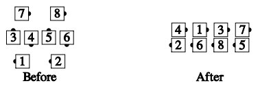

# Unwrap the \<formation>

From Diamonds, an Hourglass, Interlocked Diamonds, etc.: The trailing point
walks straight ahead to become #1 in a column; 
others [Circulate](../b1/circulate.md) their formation
and follow that person into Columns. (Note: The caller may also designate the
leader.) 

Unwrap the Diamond:

> 
> 
> 

###### @ Copyright 1983, 1986-1988, 1995-2022 Bill Davis, John Sybalsky and CALLERLAB Inc., The International Association of Square Dance Callers. Permission to reprint, republish, and create derivative works without royalty is hereby granted, provided this notice appears. Publication on the Internet of derivative works without royalty is hereby granted provided this notice appears. Permission to quote parts or all of this document without royalty is hereby granted, provided this notice is included. Information contained herein shall not be changed nor revised in any derivation or publication.
