# Unwrap the \<formation>

From any of the following, typically with all dancers having the same handedness:
- Diamonds (Twin, Point-to-Point, or Interlocked)
- Hourglass
- Galaxy
- Triangles (Wave-Based, Tandem-Based, or 3 by 1)
- Butterfly
- Boxes

Two dancers facing in act as “Unwrap Leaders” by walking straight ahead (and veering
slightly inward if necessary) to become #1 in a Column. The other dancers do <formation>
Circulates until they reach the starting position of an Unwrap Leader and then walk straight
ahead, following the preceding dancer(s) into a Column. If there are more than two dancers
facing in, the ones closest to the center of the set lead the Unwrap.

Unwrap the Diamonds is illustrated below. From Twin Diamonds, the only dancers facing in
are the Trailing Points (#2 and #7); they lead the Unwrap. (The dancers in the Center Wave
are not considered to be facing in or facing out.) From Point-to-Point Diamonds, no Points are
facing in, but one Center of each Diamond is (#3 and #6); those two dancers lead the Unwrap.

>
> 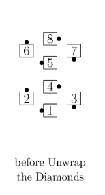
> 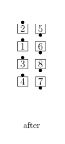
> 
> 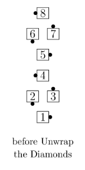
> 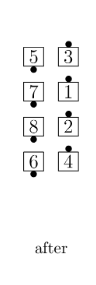
> 

Other examples with only two dancers facing in are illustrated below. On Unwrap the
Hourglass, the Trailing Points (#2 and #7) lead. On Unwrap the Galaxy and the other
example calls from a Galaxy, the Trailers in the Center Box lead.

>
> 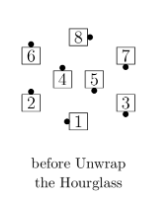
> 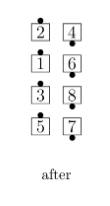
>
> 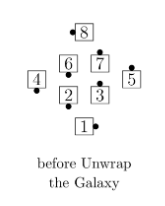
> 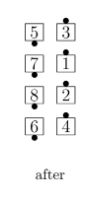
>
> 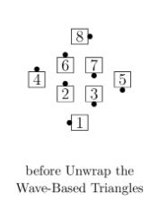
> 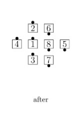
>
> 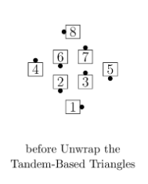
> 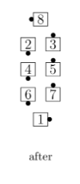
>

The next set of examples illustrates formations where there are more than two dancers facing
in, and the ones closest to the center of the set lead the Unwrap. For example, in the Butterfly
diagram, dancers #1, #3, #6, and #8 are facing in. Among those dancers, #3 and #6 are closest
to the center of the set and lead the Unwrap.

>
> 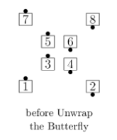
> 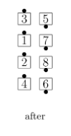
>
> 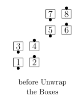
> 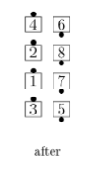
>

Regardless of the number of dancers facing in, it is helpful for the Unwrap Leader to raise
their hand to make it clear to the other dancers whom they should follow.

The caller may also designate specific dancers to lead the Unwrap. The designated dancers
are typically facing in or the Very Centers of the formation.

Very Centers Lead, Unwrap the Diamonds:

>
> 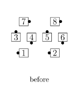
> 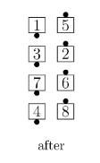
>

Very Centers Lead, Unwrap the Boxes:

>
> 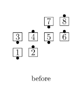
> 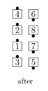
>

The caller may select any Unwrap Leaders provided that the dancers can reasonably follow
those leaders into a Column. The caller may also use this syntax to assist the dancers by
explicitly designating the default Unwrap Leaders.

Other formations besides those listed above may be used with Unwrap, as long as
“<formation> Circulate” is defined and it is clear who leads the Unwrap. For example, from
a suitable O, “Head Boys Lead, Unwrap the O.” Note that a designator is required in this
example, because from an O, all dancers are equally far from the center of the set.

Unwrap cannot be fractionalized or interrupted, and dancers do not pause or take hands after
each <formation> Circulate. Dancers typically blend the <formation> Circulates into
adjusting to Columns, so that the dance action resembles smoothly unwinding a string from
a ball. From some formations, the dancers who would finish last in the Column omit or modify
their final <formation> Circulate to simply line up behind the dancer they are following. Only
the last dancer in each Column may be able to Roll, as the others are considered to be moving
forward for their final action. The last dancer in each Column takes their Roll direction from
their final <formation> Circulate.

The examples shown so far illustrate formations where all dancers have the same
handedness and are therefore going the same direction along the <formation> Circulate path.
From formations such as Facing Diamonds, where dancers move in opposing directions,
everyone does their own part as if the other dancers had the same handedness formation they
have. Any dancer that ends on the same spot as another dancer takes right hands, forcing
some dancers to adjust outward.

>
> 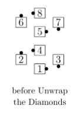
> 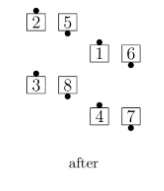
>

Unwrap from Facing Diamonds is not commonly used at C-2.

Note: This definition was changed in 2026 to allow more formations and provide a more
general rule for who leads the Unwrap. Some of these additions have not been widely used
at C-2, and others (such as Unwrap the Butterfly and Unwrap the Boxes) have not been
widely used at any program.

###### @ Copyright 1983, 1986-1988, 1995-2026 Bill Davis, John Sybalsky and CALLERLAB Inc., The International Association of Square Dance Callers. Permission to reprint, republish, and create derivative works without royalty is hereby granted, provided this notice appears. Publication on the Internet of derivative works without royalty is hereby granted provided this notice appears. Permission to quote parts or all of this document without royalty is hereby granted, provided this notice is included. Information contained herein shall not be changed nor revised in any derivation or publication.
