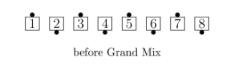
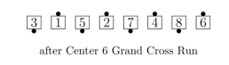
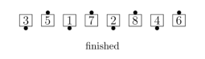

# Grand Mix / Grand Swing and Mix / Grand 1/4 (or 3/4) Mix

## Grand Mix

**Parts:** 2  

From a Generalized Tidal Line:
***Center pairs of dancers (3 pairs from an 8-dancer Tidal
Line, 2 pairs from a 6-dancer Tidal Line) "Grand Cross Run***"
***new Center pairs of dancers
[Trade](../b2/trade.md)***.
"Grand Cross Run"
means that the dancers in each pair do a Run into a once-removed
spot, on the far side of the other dancer in their own pair, as if
they were the center pair of their own 4-person Line. Ends in a Tidal Line.

> 
> 
> 
> 
> 

### Teaching Notes
From an 8-dancer line, the second part is
simply Triple Trade. Some dancers find it easier to think about the
first part as Center pairs trade (typically Triple Trade), and all
Spread. So, when getting the correct part division is not an issue,
from an eight-dancer line the call can be thought of as Triple Trade,
all Spread, and Triple Trade. Note, however, that this will not give
the correct rolling direction for the very ends.

## Grand Swing and Mix

**Parts:** 3  

From a Generalized Tidal Line: 
Swing, then do the parts of a Grand Mix. Ends in a Tidal Line.

## Grand 1/4 (or 3 /4) Mix

**Parts:** 3  

From a R-H Column, or other applicable formations: Those who
can, Right Arm Turn 1/4 (or 3/4), then all do the parts of a Grand
Mix. Ends in a Tidal Line.

###### @ Copyright 2004-2024 Vic Ceder and CALLERLAB Inc., The International Association of Square Dance Callers. Permission to reprint, republish, and create derivative works without royalty is hereby granted, provided this notice appears. Publication on the Internet of derivative works without royalty is hereby granted provided this notice appears. Permission to quote parts or all of this document without royalty is hereby granted, provided this notice is included. Information contained herein shall not be changed nor revised in any derivation or publication.
<!-- Parts
GrandMix1
GrandMix2
-->