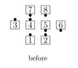

# Interlocked Extend 

From a 1/4 Line only: In one smooth motion, As Couples Extend and each line Slither.
Ends in Parallel Waves.

>
> 
> 
>

###### @ Copyright 2004-2022 Vic Ceder and CALLERLAB Inc., The International Association of Square Dance Callers. Permission to reprint, republish, and create derivative works without royalty is hereby granted, provided this notice appears. Publication on the Internet of derivative works without royalty is hereby granted provided this notice appears. Permission to quote parts or all of this document without royalty is hereby granted, provided this notice is included. Information contained herein shall not be changed nor revised in any derivation or publication.