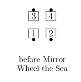
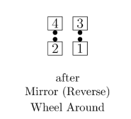
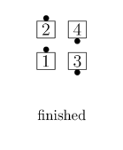
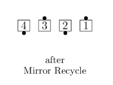
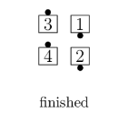
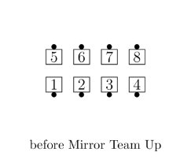
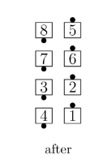
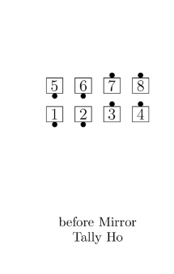
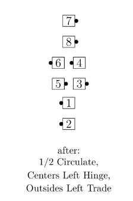
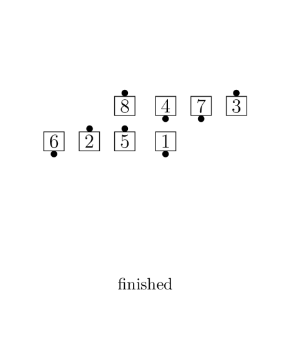

# Mirror Concept

Do the "Mirror Image" of the call.
Replace all uses of "right" with "left" and vice versa,
replace all uses of "Beaus" with "Belles" and vice versa,
and replace all uses of "promenade"
(or "counterclockwise") with "reverse promenade"
(or "clockwise") and vice versa. For example:

- If the call normally uses right hands or a right shoulder pass, 
use left hands or a left shoulder pass instead.
- If the call normally directs the Beaus to take an action,
the Belles take that action instead.
- If the call normally directs dancers to "1/4 to promenade (direction)",
then do a "1/4 to reverse promenade (direction)" instead.

For some calls, Mirror is the same as
the Left or Reverse versions of the calls already in use
on other programs. Mirror Square Thru is the same as
Left Square Thru, Mirror Swing Thru is the same as Left Swing Thru,
and Mirror Swap Around is the same as Reverse Swap Around.

The Mirror concept allows the "Mirror Image" idea
to be used with calls where neither Left nor Reverse seems appropriate,
such as Slide Thru. On a Mirror Slide Thru, everyone
passes left shoulders, then the Boys face left and the Girls face right.
Below are some calls that are commonly used with Mirror:

>
> 
> 
> 
>
> 
> 
> 
>

On Mirror Team Up from the formation below,
the Ends meet with left hands and the
Centers do a Belles Run as Beaus Dodge:

>
> 
> 
>

Mirror automatically applies throughout the entire call,
including any adjustments or additional rules.
This helps resolve some ambiguities that can arise when using Left.
Specifically, Mirror applies to all of the following
(if relevant to that call):

1. applying the Facing Couples or Ocean Wave Rules,
2. doing the main call,
3. applying any additional directions, modifiers, or replacement calls, and
4. applying the Same Position Rule.

For example, if the Mirror Concept is applied to a call such as
Tally Ho that may contain Partner Hinges, Partner Trades,
and dancers finishing on the same spot at the end,
any Partner Hinges or Partner Trades become left-handed,
and any dancers finishing on the
same spot take left hands instead of right hands.

>
> 
> 
> 
>

Similarly, if the call is "Mirror Tally Ho But Swing Thru",
the Mirror concept applies to the
Swing Thru as well as the individual parts of Tally Ho.

###### @ Copyright 2004-2024 Vic Ceder and CALLERLAB Inc., The International Association of Square Dance Callers. Permission to reprint, republish, and create derivative works without royalty is hereby granted, provided this notice appears. Publication on the Internet of derivative works without royalty is hereby granted provided this notice appears. Permission to quote parts or all of this document without royalty is hereby granted, provided this notice is included. Information contained herein shall not be changed nor revised in any derivation or publication.
