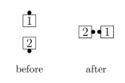
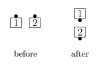

# Single Calls

The calls in this section are all variations on other calls
with similar names. In these calls, each dancer performs an action
similar to what two dancers would be doing in the original call. They
are "half size" versions of the original calls, involving half as
many dancers (4 instead of 8, or 2 instead of 4).

Note that there are other calls that have a similar
relationship (for example, "Single Wheel" is the 2-dancer version of Wheel
and Deal), but there are also calls with names beginning with the
word "Single" that do not relate to another call in the same way
(for example, "Single Circle to a Wave"). Refer to the definition of each
individual call to find out its meaning. Also note that the two-word
combination "Single File" has a different meaning.

## Single Checkmate

From a 2x2 formation: Leaders Box Circulate twice and 1/4 In
(as in Box Transfer) as Trailers Box Circulate, 1/4 In, and Box
Circulate. Ends in a 2x2. This call cannot be fractionalized.

> 
> 
> 
> 

## Single Ferris Wheel

From a Mini-Wave Box or applicable 2x2 T-Bone: Leaders Single
Wheel; Trailers Extend and Single Wheel. A Mini-Wave Box ends in
Facing Tandems. This can be thought of as a Follow Thru and Roll.

> 
> 
> 
> 

## Single Polly Wally

From a General Column of 4: Ends turn 1/4 to put their left
shoulder toward the center of the column, Step Ahead, turn another
1/4 in their initial turning direction, and adjust to end in a 2x2
formation.

Centers turn 1/4 to put their left shoulder toward the center
of the column, Step Ahead, turn 1/4 to put their left shoulder toward
the center, and Step Ahead to become Lead Belles in a 2x2 formation.

> 
> 
> 
> 

A **Reverse Single Polly Wally** is the mirror image of Single
Polly Wally. Everyone starts by putting their right shoulder toward
the center of the column.

### Teaching Notes
For Single Polly
Wally, the action for the Ends is equivalent to Reverse Single Turn
to a Line. For Reverse Single Polly Wally, the action for the Ends is
equivalent to Single Turn to a Line.

## Single Rotary Spin

From a Single Eight Chain Thru: Right Pull By; centers Left
Touch 3/4 while the ends 3/4 Left (turn in place to the left for 3/4
of a turn). Ends in a R-H Wave.

> 
> 
> 
> 

## Single Shakedown

From dancers back-to-back only:
In one smooth motion, Quarter Right, two-person
Counter Rotate, and Roll. This call cannot be fractionalized.

Comment: "Two-person Counter Rotate" is equivalent
to a Mini-Wave Hinge, but does not imply hand contact.
This choice of wording emphasizes the relationship to Shakedown.

> 
> 
> 

## Single Turn and Deal

From a Couple or Mini-Wave:
In one smooth motion, Partner Half Tag, and turn another quarter
in the same direction as when starting the Partner Half Tag. 
This call cannot be fractionalized.

Comment: "Partner Half Tag" is equivalent to Quarter In and Touch. 
This choice of wording emphasizes the relationship to Turn and Deal.

> 
> 
> 

## Single Turn to a Line

From a General Tandem (Column of 2): Leaders face right,
Trailers face left; Step Thru; all face again in their initial
turning direction (as in Turn and Deal) to end facing opposite to
their initial direction in a couple or mini-wave. This call cannot be
fractionalized.

> 
> 
> 
> 

A **Reverse Single Turn to a Line** is the mirror image of Single
Turn to a Line. The Leaders start by facing left, the Trailers start
by facing right.

###### @ Copyright 2004-2024 Vic Ceder and CALLERLAB Inc., The International Association of Square Dance Callers. Permission to reprint, republish, and create derivative works without royalty is hereby granted, provided this notice appears. Publication on the Internet of derivative works without royalty is hereby granted provided this notice appears. Permission to quote parts or all of this document without royalty is hereby granted, provided this notice is included. Information contained herein shall not be changed nor revised in any derivation or publication.
