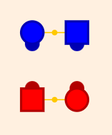
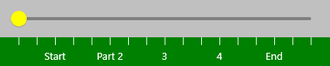

## How to Use Taminations

While the basic operation of the program is self-explanatory, 
here are some of the details.

### Dancers

>
> 
> 

The squares are boy, circles are girls.
The dark semicircles show the direction each dancer is facing.
Handholds are shown by the orange connectors.  All handholds are shown the same way,
there's no difference between waves, couples, courtesy turn, or other styling.
Colors show the different couples, but that can be changed in the Settings.

Click/Tap on a dancer to show its path. Right Click/Long Press on a dancer and you can
change its color.

### Slider

>
> 
> 

The slider controls and is moved by the current progress of the animation.
You can drag the slider with your mouse or finger to move the animation manually.

Below the slider is the scale.  Each tick on the scale is one square dance beat.
Calls with more than one part or that can be divided into fractions will have
those shown on the scale.

### Buttons

>
> 
> 

The center button starts and stops the animation.  Buttons on each end advance to the
next or previous part or fraction.  The buttons inbetween move the animation a small amount.

### Settings

Go to the Settings for more options.  You can control the speed
of the animation, automatic looping, and additional display features.