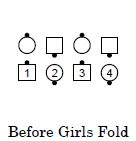
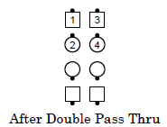
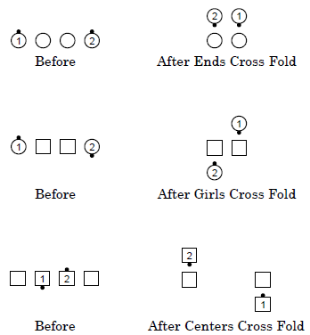
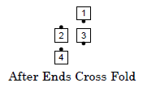
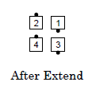

# Fold / Cross Fold

## Case 1: Fold

### Starting formations

Couple, Mini-Wave

### Command examples

#### Boys Fold
#### Ends Fold (from a General Line)
#### Ladies Fold
#### Leaders Fold (from Ocean Waves)

### Dance action

The designated dancer steps forward and walks in a semi-circle toward the adjacent dancer to end facing that position. The non-designated dancer is inactive and does not move.

### Ending formation

Facing dancers, Tandem

### Timing

2

### Styling

None

### Comments

Fold can create formations that are very unusual at Mainstream. In such situations, callers generally use implicit adjustments to normalize the formation. For example, Heads Square Thru 4, Touch 1/4, Girls Fold, Double Pass Thru:

1. The Girls Fold creates a formation with Tandems that are not directly facing. 
1. Double Pass Thru implicitly tells dancers that they should be in the starting formation for that call (facing Tandems). 
1. The Double Pass Thru is danced as if the tandems were facing, ending normally.

This type of implicit adjustment is generally accepted at Mainstream, particularly following Fold or Cross Fold, but may be controversial at other dance programs.

> 
> 
> 
> 
> 

From a 1x8, callers must be careful when identifying Centers and Ends, such as by saying "Each Side, Centers Fold" or "In Each Wave Of 4, Ends Fold" or "Girls Fold". See "General: Ways Of Naming Dancers: Centers / Ends".

The facing direction of the non-designated dancer does not affect this call. For example, from properly arranged Facing Lines: Centers Star Thru, Ends Pass Thru and Fold, You're Home.

Everyone Fold (or Everybody Fold To Face) is a gimmick (see Additional Detail: Commands: Gimmicks), since those who Fold are not working with inactive dancers. Callers who use this expect it to end in facing dancers (even though the Dance Action requires dancers to be facing the position to which they were originally adjacent, and therefore not be facing). This gimmick may not be used from a Couple.

## Case 2: Cross Fold

### Starting formation

General Line

### Command examples

#### Girls Cross Fold
#### Ends Cross Fold
#### Each Side, Ends Cross Fold (from a Tidal Wave)

### Dance action

Designated dancers step forward and walk in a semicircle, passing both the center of the line and one dancer position, to end facing the position of the next dancer. Non-designated dancers are inactive and do not move.

### Ending formations

See Comments.

### Timing

4

### Styling

None

### Comments

For Ends Cross Fold when the ends are facing the same way, they pass right shoulders with each other. For Centers Cross Fold when the centers are facing the same way, they Half Sashay, blending into a Fold to face the original far end position.

The ending formation of Cross Fold depends on which dancers Cross Fold and their original facing directions. For example:

> 
> 
> 

The ending formation can be unusual and callers generally normalize the formation with the next call or two, such as in the following example.

> 
> 
> 
> 
> 

Callers may also normalize the formation by using implicit adjustments 
(see the first comment of Fold) or by using calls like 
Right and Left Grand, Swing and Promenade, or Allemande Left.

From a 1x8, the caller must make it clear to the dancers that they must work
either in their line of four on each side (e.g., Each Side, Ends Cross Fold)
or in the center line of four (e.g., Center Four, Centers Cross Fold).

As with Fold, the facing directions of the non-designated dancers do not affect this call.

Similar to Everyone Fold (see its comment above), Everyone Cross Fold is a gimmick,
but one that is even less frequently used.

###### @ Copyright 1994, 2000-2019 by CALLERLAB Inc., The International Association of Square Dance Callers. Permission to reprint, republish, and create derivative works without royalty is hereby granted, provided this notice appears. Publication on the Internet of derivative works without royalty is hereby granted provided this notice appears. Permission to quote parts or all of this document without royalty is hereby granted, provided this notice is included. Information contained herein shall not be changed nor revised in any derivation or publication.
