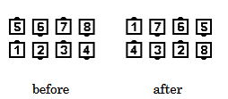

# Acey Deucey

### Starting formation
Parallel Waves or Two-Faced Lines.

### Dance Action
Center 4 [Trade](../ms/trade.md) while the others
[Circulate](../ms/circulate.md).

>
> 
>

### Ending formations
Parallel Waves or Two-Faced Lines end in the same formation as at the start.

### Timing
4

### Comment
Other formations are also acceptable. There must be 4 Centers
and 4 Ends (or Outsides). The Centers must be able to Trade in
adjacent Pairs of 2 and the Ends (or Outsides) must be able to
Circulate and not become Centers.

###### @ Copyright 1997, 2001-2026 by CALLERLAB Inc., The International Association of Square Dance Callers. Permission to reprint, republish, and create derivative works without royalty is hereby granted, provided this notice appears. Publication on the Internet of derivative works without royalty is hereby granted provided this notice appears. Permission to quote parts or all of this document without royalty is hereby granted, provided this notice is included. Information contained herein shall not be changed nor revised in any derivation or publication. 1997, 2001-2025 by CALLERLAB Inc., The International Association of Square Dance Callers. Permission to reprint, republish, and create derivative works without royalty is hereby granted, provided this notice appears. Publication on the Internet of derivative works without royalty is hereby granted provided this notice appears. Permission to quote parts or all of this document without royalty is hereby granted, provided this notice is included. Information contained herein shall not be changed nor revised in any derivation or publication.
