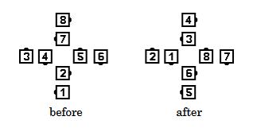

# All 8 Spin the Top

### Starting formation
Thar Star (stationary or in motion), Wrong Way Thar
(stationary or in motion), Right and Left Grand Circle.

### Dance action
If started from a Thar Star or Wrong Way Thar, any motion is stopped,
***the handholds forming the Center Star are released, and each
Center dancer and the adjacent outside dancer Arm Turn one-half
(180°).*** ***The new Centers Star Right (or Star Left) 3/4
(270 degrees) (walking forward),
while the new Outsides move forward 1/4 (90 degrees) around the
perimeter of the Circle to join hands
with the same person again in a stationary Thar Star or
Wrong Way Thar formation.***

If started from a Right and Left Grand Circle, everyone Turns by
the Right 1/2 with the person they are facing,
then completes the call as above (new Centers Star left
3/4, etc.). The ending formation is a stationary Wrong Way Thar.

From a Right and Left Grand Circle, the command 
**All 8 Left Spin The Top**
has everyone Turn by the Left 1/2 with the dancer they are facing
and then completes the call as above
(new Centers Star Right 3/4, etc.)
ending in a stationary Thar Star formation.

### Ending formations
Thar Star or Wrong Way Thar

The diagram shows All 8 Spin the Top starting
from a Wrong Way Thar. Everyone Turns by the
Right 1/2, then new Centers Star Left 3/4 while
Outsides move around 1/4.

>
> 
>

### Timing
10

### Styling
The initial Arm Turn 1/2 is a forearm turn.
The star portion is performed using standard star styling
utilizing palm star hand positioning.
Outside dancers moving forward have hands in
natural dance position,
ready to assume appropriate position for the next call. Ladies may
use skirt work.

### Comment
The Facing Couples Rule applies to All 8 Spin the Top.

###### @ Copyright 1997, 2001-2026 by CALLERLAB Inc., The International Association of Square Dance Callers. Permission to reprint, republish, and create derivative works without royalty is hereby granted, provided this notice appears. Publication on the Internet of derivative works without royalty is hereby granted provided this notice appears. Permission to quote parts or all of this document without royalty is hereby granted, provided this notice is included. Information contained herein shall not be changed nor revised in any derivation or publication. 1997, 2001-2025 by CALLERLAB Inc., The International Association of Square Dance Callers. Permission to reprint, republish, and create derivative works without royalty is hereby granted, provided this notice appears. Publication on the Internet of derivative works without royalty is hereby granted provided this notice appears. Permission to quote parts or all of this document without royalty is hereby granted, provided this notice is included. Information contained herein shall not be changed nor revised in any derivation or publication.
