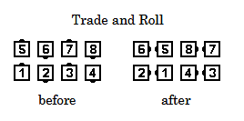
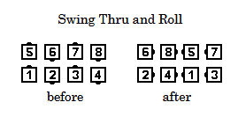
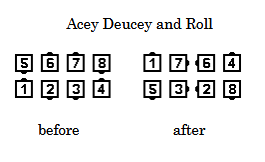
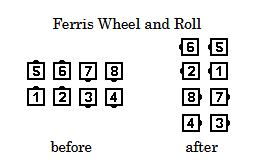

# Anything and Roll

### Starting formation
Various

### Dance action
The term "... & Roll" may be added to any call which, by definition,
causes one or more dancers to have turning body flow to the right or left
**as they complete their portion of the call**.
It is an instruction to those dancers to turn
individually, in place, one quarter (90°) more in the direction of body flow
determined by the preceding command. 

Note that if "... and Roll" is added to a call, which by definition, has some
dancers walking in a straight line at the completion of their portion of the call, those
dancers will do nothing for the "... and Roll". 

### Timing
2

### Styling 
At the completion of the movement preceding the roll (anything), release all handholds and allow the established momentum to set the direction for the solo turn in place. Arms are returned to  natural dance position and ready to assume appropriate position for the next call.

>
> 
> 
> 
> 
>

### Comment
A statement that certain dancers “can Roll” after a call means that as those dancers
complete their portion of the call, they will have turning body flow that would enable them to
Turn 1/4 (90 degrees) in place if “and Roll” were appended to the call. Examples: after Swing
Thru, everyone can Roll; after Scoot Back from a Right-Hand or Left-Hand Box, only the Original
Leaders can Roll; at the end of Pass the Ocean, all dancers are defined to be moving forward as
they Step to a Wave, so no one can Roll

###### @ Copyright 1997, 2001-2026 by CALLERLAB Inc., The International Association of Square Dance Callers. Permission to reprint, republish, and create derivative works without royalty is hereby granted, provided this notice appears. Publication on the Internet of derivative works without royalty is hereby granted provided this notice appears. Permission to quote parts or all of this document without royalty is hereby granted, provided this notice is included. Information contained herein shall not be changed nor revised in any derivation or publication. 1997, 2001-2025 by CALLERLAB Inc., The International Association of Square Dance Callers. Permission to reprint, republish, and create derivative works without royalty is hereby granted, provided this notice appears. Publication on the Internet of derivative works without royalty is hereby granted provided this notice appears. Permission to quote parts or all of this document without royalty is hereby granted, provided this notice is included. Information contained herein shall not be changed nor revised in any derivation or publication.
