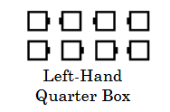

# Anything and Spread

*Starting formations for the Spread action 
(that is, where the (Anything) call would end if
completed):* 
Double Pass Thru, Eight Chain Thru, Right-Hand or Left-Hand Quarter Box,
General Line of Four, General Parallel Lines, 
General Crossed Lines, and General Tidal Line.
(See Formation Note below.)

>
> 
> 
> 
> 
>

In the diagrams below, a square with two “noses” indicates that
the dancer in that position may
be facing in either of two directions.

>
> 
> 
> 
> 
>

As the dancers complete the (Anything) call, 
the centers slide apart while each end moves forward
or sideways into the nearest vacated center position.
Centers exchanging places with ends pass
in front of those ends unless the body flow dictates otherwise.

When the starting formation is one or two General Lines,
the Spread action is performed within each line.

Dancers should adjust their motion to blend smoothly
into the Spread action as the preceding
(Anything) call finishes.

From a General Line, doing just 1/2 of the Spread action produces a Box.

Comments: The following examples describe 
some of the commonly used applications.

Typical uses where centers slide apart and ends step forward between them:
- From Parallel Two-Faced Lines: Ferris Wheel and Spread
- From a Static Square: Heads Touch 1/4 and Spread

Typical uses where all dancers slide face-to-face:
- From Parallel Waves: Follow Your Neighbor and Spread
- From a Right-Hand Tidal Wave: Grand Swing Thru and Spread
- From a Thar Star: All 8 Spin the Top and Spread
- From a Right-Hand Box: Follow Your Neighbor and 1/2 Spread (result is Facing Couples)

Typical uses where designated dancers slide face-to-face:
- From a Static Square: Sides Spin the Top and Spread (the Sides slide face-to-face)
- From BBGG waves: Spin the Top and the Girls Spread (just the Girls slide face-to-face)

Typical uses where centers slide in front of ends, but not face-to-face:
- From Parallel Two-Faced Lines: Acey Deucey and Spread
- From Parallel Two-Faced Lines: Fan the Top and Spread
- From Facing Lines: Bend the Line and Spread

A typical use where the body flow dictates that centers slide behind the ends:
• From Lines Facing Out: Bend the Line and Spread

Formation Note: From a Squared Set, 
"Heads Touch 1/4" makes a Right-Hand Quarter Box.
A Thar Star is an example of General Crossed Lines.

Historical Note: This definition was changed in 2025 
to simplify the rules. Former 8-dancer
applications of the Spread action
where the Leaders or Actives are not in the center are now improper 
(for example, “Double Pass Thru and Spread”).
In many of those cases, “Centers In” can be used instead

###### @ Copyright 1997, 2001-2025 by CALLERLAB Inc., The International Association of Square Dance Callers. Permission to reprint, republish, and create derivative works without royalty is hereby granted, provided this notice appears. Publication on the Internet of derivative works without royalty is hereby granted provided this notice appears. Permission to quote parts or all of this document without royalty is hereby granted, provided this notice is included. Information contained herein shall not be changed nor revised in any derivation or publication.
