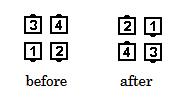

# Chase Right

### Starting formation
Two Couples Back-to-Back. 

### Dance action
Each right-hand dancer does an exaggerated [Zoom](../ms/zoom.md) action,
moving into the position
previously occupied by the right-hand dancer in the Couple behind,
to finish facing in the same direction as at the start.
(The net result is the same as if the
right-hand dancer had done a right face [U Turn Back](../ms/turn_back.md) and
[Box Circulate](../ms/circulate.md) twice). The
left-hand dancer follows ("Chases") the right-hand dancer by doing a
[Box Circulate](../ms/circulate.md) two positions. The call finishes in a Box Circulate formation. 

### Ending formation
Right-Hand Box

>
> 
>

### Timing
6

## Left Chase
The left-hand dancer does the exaggerated Zoom action to the left
and the right-hand dancer follows by doing a Box Circulate two positions.
The ending formation is a Left-Hand Box

### Styling
All dancers have  arms in natural dance position. 
Ladies'  skirt work optional. 
Right hand dancer uses flowing motion rather than an abrupt turn around.

When two Couples (for example, the Heads) do Chase Right in the center of the
square, it is important for those doing the Zoom motion to keep the action
tight and avoid bumping into the outside dancers. At the same time, those,
not involved in the Chase Right, move, if possible and comfortable, away
from the center to allow more space for the action.

###### @ Copyright 1997, 2001-2026 by CALLERLAB Inc., The International Association of Square Dance Callers. Permission to reprint, republish, and create derivative works without royalty is hereby granted, provided this notice appears. Publication on the Internet of derivative works without royalty is hereby granted provided this notice appears. Permission to quote parts or all of this document without royalty is hereby granted, provided this notice is included. Information contained herein shall not be changed nor revised in any derivation or publication. 1997, 2001-2025 by CALLERLAB Inc., The International Association of Square Dance Callers. Permission to reprint, republish, and create derivative works without royalty is hereby granted, provided this notice appears. Publication on the Internet of derivative works without royalty is hereby granted provided this notice appears. Permission to quote parts or all of this document without royalty is hereby granted, provided this notice is included. Information contained herein shall not be changed nor revised in any derivation or publication.
