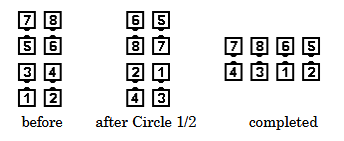

# Circle to a Line

### Starting formation

Eight Chain Thru

### Command examples

#### Circle to a Line
#### Heads Lead Right; Circle to a Line, Head Men Break, Make a Line of 4
#### Sides Star Thru, California Twirl, Circle to a Line
#### Heads Left Touch 1/4, Walk and Dodge, Circle to a Line

### Dance action

Each group of Facing Couples [Circle Left](../ms/circle.md) 1/2 (180 degrees).
The left-side dancer in the new Outside Couple releases the left handhold and
slides sideways to the left to become the left end of a One-Faced Line
(which faces the line formed by the other four dancers).
All other handholds are maintained. The other dancers continue circling,
gradually blending into the One-Faced Line by unwinding the circle.
The final dancer replaces the unwinding action with a forward and
left-turning twirl, walking under an arch made with the adjacent dancer,
similar in action to a California Twirl.

### Ending formation
Facing Lines

>
> 
>

### Timing
8

### Styling

The circle portion is the same styling as in [Circle Left](../ms/circle.md).
Dancers lead the twirl under the arch by raising their joined hands into an arch.

### Comments

A wider variety of Command Examples are often used (for example, "Circle Up 4, Break Out, Make a Line", "Circle 4, Side Man Break to a Line", "Circle Up 4, Bust Out to a Line"). Some feel that the words "Circle to a Line" must always be included, whereas others feel that other options are acceptable if the meaning is clear. Callers are cautioned that the distinction between circling "to a line" and circling "to another action" (for example, "Heads Lead Right; Circle Left Halfway; Dive Thru") can be lost if care is not taken in their choice of words.

Some callers identify who "breaks" (that is, who lets go with the left hand to become the left end of the final line). These helping words are optional; if used, they refer to the outside left-side dancer after Circle Left 1/2.

This definition gives the proper way that Circle to a Line should be danced and styled. There are other dance actions in popular use (with the same ending result). Dancers and callers should be aware that they may encounter these variations and that this call requires cooperation to be danced successfully.

For **Reverse Circle to a Line**, Facing Couples Circle Right 1/2,
the right-side dancer in the new
Outside Couple slides sideways to the right,
and the final dancer does a right-turning twirl.

Some callers extend Circle To A Line (designating different dancers to break, or circling a different amount), while others think such extensions are improper. In any case, there has never been consensus on how they work, and these applications require workshopping.

###### @ Copyright 1997, 2001-2026 by CALLERLAB Inc., The International Association of Square Dance Callers. Permission to reprint, republish, and create derivative works without royalty is hereby granted, provided this notice appears. Publication on the Internet of derivative works without royalty is hereby granted provided this notice appears. Permission to quote parts or all of this document without royalty is hereby granted, provided this notice is included. Information contained herein shall not be changed nor revised in any derivation or publication. 1994, 2000-2023 by CALLERLAB Inc., The International Association of Square Dance Callers. Permission to reprint, republish, and create derivative works without royalty is hereby granted, provided this notice appears. Publication on the Internet of derivative works without royalty is hereby granted provided this notice appears. Permission to quote parts or all of this document without royalty is hereby granted, provided this notice is included. Information contained herein shall not be changed nor revised in any derivation or publication.
