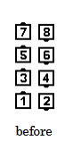
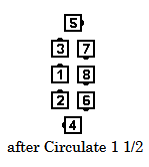
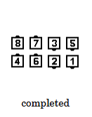

# Coordinate

### Starting formation
At Plus, only from Right-Hand or Left-Hand Columns

### Dance action
***[Circulate](../ms/circulate.md)***.
***Then 1/2 (Half) Circulate.***.
***Triple Trade (the three adjacent Pairs in the center Trade).***
*** The Very Center Two dancers release handholds and walk diagonally outward
without turning, while the two lonesome dancers walk ahead, moving in a 1/4 (90-degree) circle. ***

### Ending formations
From Right-Hand Columns, Coordinate ends in Right-Hand Two-Faced
Lines. From Left-Hand Columns, Coordinate ends in Left-Hand Two-Faced Lines

>
> 
> 
> 
>

### Styling
Use hands up position for trading action. 
After the Very Center Two dancers release handholds and move forward, 
all dancers join hands with a Couple handhold.
No time allowed for skirt work.

### Timing
8

\[ for non-standard applications of Coordinate,
see the [Advanced definition](../a1/coordinate.md) ]

###### @ Copyright 1997, 2001-2026 by CALLERLAB Inc., The International Association of Square Dance Callers. Permission to reprint, republish, and create derivative works without royalty is hereby granted, provided this notice appears. Publication on the Internet of derivative works without royalty is hereby granted provided this notice appears. Permission to quote parts or all of this document without royalty is hereby granted, provided this notice is included. Information contained herein shall not be changed nor revised in any derivation or publication. 1997, 2001-2025 by CALLERLAB Inc., The International Association of Square Dance Callers. Permission to reprint, republish, and create derivative works without royalty is hereby granted, provided this notice appears. Publication on the Internet of derivative works without royalty is hereby granted provided this notice appears. Permission to quote parts or all of this document without royalty is hereby granted, provided this notice is included. Information contained herein shall not be changed nor revised in any derivation or publication.
