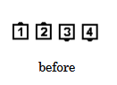
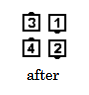
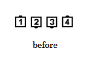
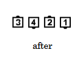

# Crossfire

### Starting formation
Two-Faced Line, Inverted Line, One-Faced Line

As the Centers begin to [Trade](../ms/trade.md), the Ends 
[Cross Fold](../ms/fold.md). Upon completing their Trade, the
Centers release hands and step straight forward 
forming an Ocean Wave or Mini-Wave with
the dancers they are facing.
If the Trade leaves the original Centers facing no one, they
step forward and remain facing out. 

### Ending formations 
Starting from a Right-Hand Two-Faced Line ends in a Right-Hand Box.
Starting from a Left-Hand Two-Faced Line ends in a Left-Hand Box. Starting from an Inverted
Line ends in a Right-Hand Wave. Starting from a One-Faced Line ends in Tandem Couples
except for the case of Lines Facing Out, which is discussed in the next paragraph.

>
> 
> 
>
> 
> 
>

Starting from Lines Facing Out ends in a 1/4 Tag formation. This is a case in which Crossfire is
treated as an eight-dancer call rather than a four-dancer call. For this application callers might
need to use extra words to clarify the ending formation. Another approach is to follow Crossfire
with a call that uses the Facing Couples Rule or the Ocean Wave Rule, so that the dance action
will be essentially the same even if some dancers mistakenly treat Crossfire from Lines Facing
Out as a four-dancer call.

Callers may use the command “Each Line, Crossfire”. Using “Each Line” modifies the action by
requiring Crossfire to be treated as a four-dancer call. From Lines Facing Out, this results in a
Double Pass Thru formation.

### Timing
6

### Styling
If starting formation is a Two-Faced Line, Center dancers use  hands up position for trading action and blend into normal Mini-Wave styling. If starting formation is Parallel Lines of Four that results in Centers facing no one, that Couple joins hands with a Couple handhold.

Timing: 6

###### @ Copyright 1997, 2001-2026 by CALLERLAB Inc., The International Association of Square Dance Callers. Permission to reprint, republish, and create derivative works without royalty is hereby granted, provided this notice appears. Publication on the Internet of derivative works without royalty is hereby granted provided this notice appears. Permission to quote parts or all of this document without royalty is hereby granted, provided this notice is included. Information contained herein shall not be changed nor revised in any derivation or publication. 1997, 2001-2025 by CALLERLAB Inc., The International Association of Square Dance Callers. Permission to reprint, republish, and create derivative works without royalty is hereby granted, provided this notice appears. Publication on the Internet of derivative works without royalty is hereby granted provided this notice appears. Permission to quote parts or all of this document without royalty is hereby granted, provided this notice is included. Information contained herein shall not be changed nor revised in any derivation or publication.
