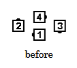
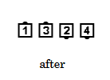
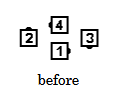
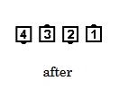

# Cut the Diamond

### Starting Formation
Any Diamond.

### Dance action
The Centers of the Diamond do a [Diamond Circulate](diamond_circulate.md) to the next position in their
Diamond, while the Points slide together and [Trade](../ms/trade.md).

### Ending formation
A Right-Hand Diamond ends in a Right-Hand Two-Faced Line. A Left-Hand
Diamond ends in a Left-Hand Two-Faced Line. A Facing Diamond ends in a Wave.

>
> 
> 
>
> 
> 
>

### Timing
6

### Styling
From a Right or Left-Hand Diamond formation, all dancers blend into a Couple
handhold. If the starting formation is a Facing Diamond, all dancers blend into hands up position
as appropriate for an Ocean Wave.

###### @ Copyright 1997, 2001-2026 by CALLERLAB Inc., The International Association of Square Dance Callers. Permission to reprint, republish, and create derivative works without royalty is hereby granted, provided this notice appears. Publication on the Internet of derivative works without royalty is hereby granted provided this notice appears. Permission to quote parts or all of this document without royalty is hereby granted, provided this notice is included. Information contained herein shall not be changed nor revised in any derivation or publication. 1997, 2001-2025 by CALLERLAB Inc., The International Association of Square Dance Callers. Permission to reprint, republish, and create derivative works without royalty is hereby granted, provided this notice appears. Publication on the Internet of derivative works without royalty is hereby granted provided this notice appears. Permission to quote parts or all of this document without royalty is hereby granted, provided this notice is included. Information contained herein shall not be changed nor revised in any derivation or publication.
