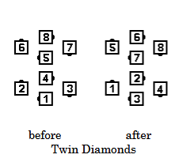
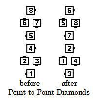
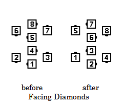

# Diamond Circulate

### Starting formation
Any Diamond

### Dance action
Each dancer moves forward to the next position in the Diamond, changing their original
facing direction 1/4 (90 degrees) toward the center of the Diamond. Points become
Centers, and Centers become Points. If the call is directed to Facing Diamonds,
all dancers must pass right shoulders. 

>
> 
> 
> 
>

### Ending formations
Circulating a Right or Left-Hand Diamond will maintain the same formation.
Circulating Facing Diamonds will exchange the handedness of the Centers and the Points.

### Timing
3

### Styling
It is important that dancers maintain the Diamond formation as they move diagonally
from one position to the next. Those moving into the center of the Diamond blend into hands up
position as in an Ocean Wave. Dancers at the Points maintain arms in natural dance position.
Ladies may utilize skirt work.

###### @ Copyright 1997, 2001-2026 by CALLERLAB Inc., The International Association of Square Dance Callers. Permission to reprint, republish, and create derivative works without royalty is hereby granted, provided this notice appears. Publication on the Internet of derivative works without royalty is hereby granted provided this notice appears. Permission to quote parts or all of this document without royalty is hereby granted, provided this notice is included. Information contained herein shall not be changed nor revised in any derivation or publication. 1997, 2001-2025 by CALLERLAB Inc., The International Association of Square Dance Callers. Permission to reprint, republish, and create derivative works without royalty is hereby granted, provided this notice appears. Publication on the Internet of derivative works without royalty is hereby granted provided this notice appears. Permission to quote parts or all of this document without royalty is hereby granted, provided this notice is included. Information contained herein shall not be changed nor revised in any derivation or publication.
